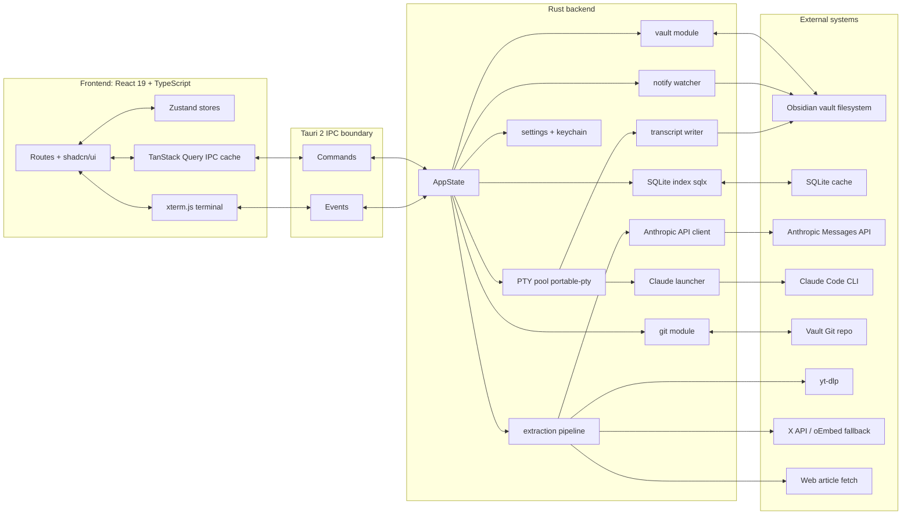
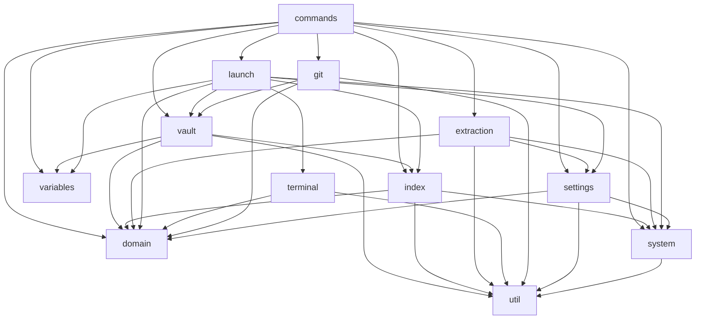
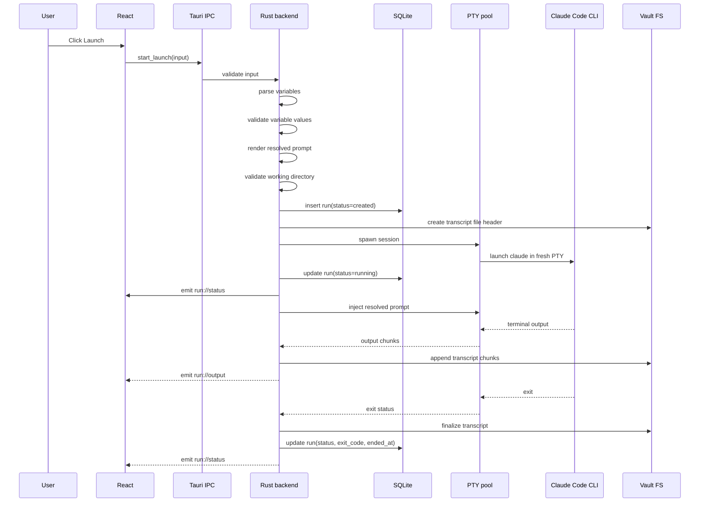
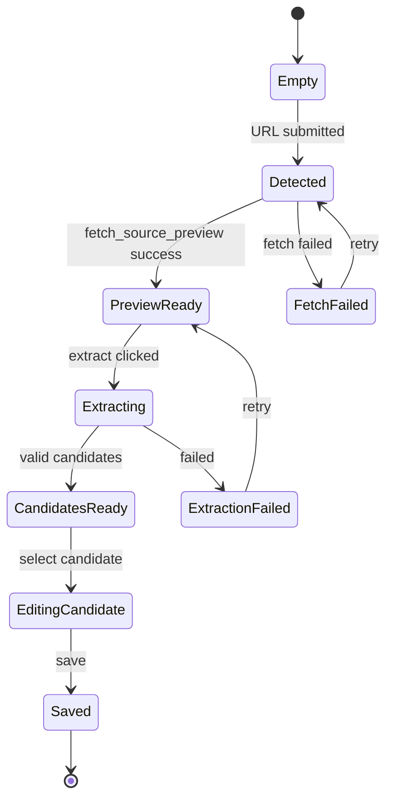

# 1. Overview and goals

Promptibrary is a local-first desktop operator console for agentic coding launches. A saved launch profile contains a prompt template, typed variables, working directory defaults, Claude Code model/permission/MCP flags, tags, source metadata, version history, and telemetry. The app stores editable prompt profiles as Markdown files in an Obsidian vault, maintains a derived SQLite index for search/telemetry, and launches each run into a fresh Claude Code CLI session inside an embedded xterm.js terminal.

## Primary user journey

The user opens `/import`, pastes a YouTube URL, and Promptibrary fetches the transcript, sends normalized source content to the configured Anthropic extraction model, and returns several candidate launch profiles. The user reviews one candidate, edits the title/body/tags/variables, and saves it into the vault as a Markdown file with YAML frontmatter. Later, the user selects the launch profile from `/`, fills typed variable controls, optionally applies an inline per-launch prompt tweak, chooses a working directory, and presses **Launch**. Promptibrary validates variables and working directory access, spawns a fresh PTY-backed Claude Code CLI session, injects the resolved prompt, streams terminal output into xterm.js, records telemetry, and writes the transcript as Markdown under `<vault>/promptibrary/runs/`.

## Non-goals for V1

| Area | Explicit non-goal |
|---|---|
| Users | No multi-user accounts, role permissions, teams, sharing server, or workspace tenancy. |
| Sync | No cloud sync independent of the Obsidian vault. Git/vault sync is user-managed. |
| Platforms | No Windows support in V1. Code must avoid Windows-specific breakage, but Windows is not tested or packaged. |
| Theme | No light theme. Dark theme only. |
| Destinations | No Cursor, ChatGPT, OpenAI Codex, shell-only runner, browser runner, or generic MCP-agent routing. |
| Live sessions | No restoring previous live PTYs. Past runs are archived transcripts only. |
| Prompt marketplace | No public prompt marketplace, ratings, remote catalog, or hosted template registry. |
| Collaboration | No comments, multiplayer editing, remote review, or shared telemetry. |
| Secrets | No vault-stored API keys or bearer tokens. Secrets live in OS keychain only. |
| Background automation | No scheduled launches, cron workflows, daemonized agents, or unattended queues. |
| Windows terminal | No Windows ConPTY implementation for V1. |

## V1 success criteria

The app is V1-complete when:

1. A user can select a vault, cold-scan prompt Markdown files, rebuild SQLite, and see an accurate searchable library.
2. Prompt files can be created, edited, archived, tagged, exported, and version-inspected through Git history.
3. Typed variable references in prompt bodies parse deterministically, render correct UI controls, validate correctly, and resolve into a final prompt string.
4. YouTube, X/Twitter, and generic web article imports produce validated extraction candidates with source metadata and saveable launch profiles.
5. A launch starts a fresh Claude Code CLI process in a validated working directory, injects the resolved prompt, streams terminal output, accepts terminal input, and records a durable transcript.
6. Runs are queryable from SQLite and viewable as read-only ANSI transcripts from `<vault>/promptibrary/runs/`.
7. File watcher events keep the SQLite prompt index consistent with vault changes without requiring manual refresh.
8. Text search, local semantic search, tag filtering, and Cmd-K navigation return correct results over prompt title/body/tags.
9. Settings persist local app preferences, keep secrets in the OS keychain, validate the vault, and expose clear diagnostics for missing dependencies.
10. Unit, integration, and E2E tests cover variable parsing, extraction validation, prompt-to-CLI invocation, watcher rescan, and transcript capture.

> The original §17 *Open questions resolved* section is no longer a separate appendix. Every decision recorded there — shadcn paths, CodeMirror choice, Readability rejection, X credential UX, embedding location, prompt naming, Git rename window, terminal font, telemetry deletion semantics, GitHub Releases updater — is now encoded in the relevant body section.

# 2. Architecture overview

## Top-level component diagram



## Dependency version intent

| Layer | Package/crate | Version intent | Reason |
|---|---|---:|---|
| Rust app shell | `tauri`, `tauri-build` | `^2` | Locked platform. Keep on Tauri 2.x. |
| Dialogs | `tauri-plugin-dialog` | `^2.7` | Native vault/file picker support. Current 2.x dialog plugin is published as 2.7.1. ([crates.io](https://crates.io/crates/tauri-plugin-dialog?utm_source=chatgpt.com)) |
| Updates | `tauri-plugin-updater` | `^2.10` | Static manifest updater; current 2.x plugin supports static JSON manifests. ([crates.io](https://crates.io/crates/tauri-plugin-updater/dependencies?utm_source=chatgpt.com)) |
| PTY | `portable-pty` | `=0.9.0` | WezTerm-backed cross-platform PTY abstraction; pin exactly because PTY behavior is high-risk. ([crates.io](https://crates.io/crates/portable-pty?utm_source=chatgpt.com)) |
| File watcher | `notify` | `=8.2.0` | Locked watcher crate; pin current major to avoid watcher semantic drift. ([crates.io](https://crates.io/crates/notify?utm_source=chatgpt.com)) |
| SQLite | `sqlx` | `=0.8.6` with `sqlite`, `runtime-tokio`, `tls-rustls` | Async SQLite access and migrations. ([crates.io](https://crates.io/crates/sqlx?utm_source=chatgpt.com)) |
| Vector search | `sqlite-vec` | `=0.1.9` | Local vector search inside SQLite. ([crates.io](https://crates.io/crates/sqlite-vec?utm_source=chatgpt.com)) |
| Embeddings | `fastembed` | `^5.13` | Local ONNX embeddings, no semantic-search API key required. ([crates.io](https://crates.io/crates/fastembed?utm_source=chatgpt.com)) |
| HTTP | `reqwest` | `^0.13` with `json`, `stream`, `rustls-tls` | Fetching sources and Anthropic API calls. ([crates.io](https://crates.io/crates/reqwest?utm_source=chatgpt.com)) |
| Git | `git2` | `^0.20` | libgit2 bindings for file history and diffs. |
| Keychain | `keyring` | `^4.0` | Native credential store access; docs show keyring 4.0.1 and native store functions. ([docs.rs](https://docs.rs/keyring?utm_source=chatgpt.com)) |
| Frontend | `react`, `react-dom` | `~19.2` | Locked frontend stack; npm currently reports React 19.2.6. ([npmjs.com](https://www.npmjs.com/package/react?utm_source=chatgpt.com)) |
| Bundler | `vite` | `^8.0` | Vite 8 is stable and uses the current Vite pipeline. ([vite.dev](https://vite.dev/blog/announcing-vite8)) |
| CSS | `tailwindcss`, `@tailwindcss/vite` | `^4.0` | Tailwind v4 with first-party Vite plugin and CSS-first config. ([tailwindcss.com](https://tailwindcss.com/blog/tailwindcss-v4)) |
| Terminal | `@xterm/xterm`, addons | `^5.5` | Locked xterm.js v5. Do not upgrade to v6 in V1. |
| Client async state | `@tanstack/react-query` | `^5.100` | Locked async state layer; npm currently reports 5.100.x. ([npmjs.com](https://www.npmjs.com/package/%40tanstack/react-query?activeTab=versions&utm_source=chatgpt.com)) |
| Client state | `zustand` | `^5.0` | Locked client state layer; npm currently reports 5.0.13. ([npmjs.com](https://www.npmjs.com/package/zustand?utm_source=chatgpt.com)) |
| UI components | `shadcn/ui`, `lucide-react`, `cmdk`, `class-variance-authority`, `tailwind-merge` | Latest compatible with React 19/Tailwind 4 | shadcn/ui is copied source via the CLI, not a runtime library. Generated into `src/shared/ui/shadcn/`; app-level wrappers in `src/shared/ui/` re-export. `components.json` aliases: `"components": "@/shared/ui/shadcn"`, `"utils": "@/shared/lib/utils"`. ESLint `no-restricted-imports` forbids importing from `@/shared/ui/shadcn` outside `@/shared/ui`. |
| Markdown editor | `@codemirror/state`, `@codemirror/view`, `@codemirror/lang-markdown` | `^6` | Prompt body editor with custom `WidgetType` decorations for typed variable refs. |
| Editor extras | `@codemirror/autocomplete`, `@codemirror/search` | `^6` | Variable name autocomplete on `{{` and in-editor search. |

## Process model

| Tauri window | ID | Responsibility |
|---|---|---|
| Main window | `main` | Entire app UI: library, prompt editor, import flow, settings, run terminal, transcript viewer, Cmd-K overlay. |
| Native dialogs | N/A | File/folder picker through Tauri dialog plugin. No custom secondary settings/import windows in V1. |
| Hidden background windows | None | No hidden renderer windows. Background work runs in Rust async tasks. |

The frontend is a single-page React app with route-level views. Active PTY sessions are not windows. They are Rust-managed processes keyed by `RunId` and surfaced through events.

## Trust model

| Boundary | Allowed responsibilities |
|---|---|
| Webview | Render UI, collect form values, hold ephemeral inline tweak state, send typed IPC commands, subscribe to events, render ANSI terminal data. |
| Rust backend | Filesystem access, vault mutation, SQLite reads/writes, keychain access, network fetches, Anthropic calls, subprocess/PTY lifecycle, Git operations, transcript writing. |
| IPC | Typed JSON payloads only. No raw filesystem mutation from frontend. No secrets sent to frontend except boolean presence/status. |
| Vault | Source of truth for prompt profiles and archived run transcripts. The vault is untrusted input and must be parsed defensively. |
| SQLite | Derived cache and telemetry store. It can be deleted and rebuilt except for telemetry not mirrored in transcript frontmatter. |
| Keychain | Only location for Anthropic API key and optional X API bearer token. |

> Assumes the selected Obsidian vault is user-controlled and Git-backed. Flag if wrong.

## Crash and recovery model

| Failure | Backend behavior | Frontend behavior | Recovery |
|---|---|---|---|
| Vault disappears mid-session | Active PTY continues if its working directory still exists. Transcript writes switch to app-support spool path `runtime/orphans/<run_id>.md`. Run status becomes `vault_unavailable` only after PTY exits. | Banner: “Vault unavailable. Active run continues. Transcript is being spooled locally.” | When vault returns, `repair_orphaned_transcripts` moves orphan transcripts into `<vault>/promptibrary/runs/` and updates SQLite. |
| Prompt file deleted while open | Watcher marks prompt missing and removes index row. Editor keeps unsaved draft in memory. | Toast with actions: “Save as new profile” or “Discard draft.” | Saving writes a new file with new ID unless original file path returns. |
| PTY process dies unexpectedly | PTY pool marks run `failed`, captures exit status if available, closes stdin writer, flushes transcript. | Terminal becomes read-only; status pill shows failure. | User can relaunch profile as a new run. No live restore. |
| Claude Code CLI exits non-zero | Run status `failed` unless stop action requested. Exit code persisted. | Run view shows exit code and transcript. | User edits profile or environment and launches a new run. |
| Anthropic API unreachable | Extraction task fails with `NetworkUnavailable` or `ProviderUnavailable`; no partial profile is saved unless candidates were already validated. | Import page shows retryable error and keeps source URL. | User retries; cached fetched source content is reused if available. |
| SQLite locked | Use WAL, `busy_timeout=5000ms`, retry with exponential backoff for 3 attempts. | If read fails, show degraded vault-only state for prompts already loaded. | If lock persists, user can run “Rebuild index.” |
| SQLite corruption | Close pool, move DB to `index.corrupt.<timestamp>.sqlite`, rebuild from vault. | Banner: “Index rebuilt after corruption. Telemetry only in corrupt DB may be unavailable.” | Prompt index restored. Run transcripts still recoverable from vault. |
| File watcher loses events | Watcher emits `RescanRequired`; backend schedules full vault rescan after 750ms debounce. | Tiny indexing indicator only. | Full scan reconciles SQLite with filesystem. |

# 3. Module structure

## `src-tauri/` file tree

```text
src-tauri/
  Cargo.toml
  build.rs
  tauri.conf.json
  capabilities/
    default.json
  migrations/
    0001_init.sql
    0002_fts.sql
    0003_embeddings.sql
    0004_telemetry.sql
  src/
    main.rs
    lib.rs
    app_state.rs
    error.rs
    ids.rs
    time.rs

    commands/
      mod.rs
      prompts.rs
      variables.rs
      vault.rs
      search.rs
      launches.rs
      runs.rs
      extraction.rs
      settings.rs
      git.rs
      system.rs

    domain/
      mod.rs
      prompt.rs
      variable.rs
      launch.rs
      run.rs
      tag.rs
      source.rs
      settings.rs
      git.rs
      search.rs
      transcript.rs

    vault/
      mod.rs
      paths.rs
      scanner.rs
      markdown.rs
      frontmatter.rs
      writer.rs
      watcher.rs
      repair.rs

    index/
      mod.rs
      db.rs
      migrations.rs
      prompts_repo.rs
      runs_repo.rs
      telemetry_repo.rs
      fts.rs
      embeddings.rs
      reindex.rs

    variables/
      mod.rs
      lexer.rs
      parser.rs
      renderer.rs
      validation.rs
      tests.rs

    extraction/
      mod.rs
      detect.rs
      fetchers/
        mod.rs
        youtube.rs
        x_twitter.rs
        article.rs
      normalize.rs
      anthropic.rs
      prompts.rs
      response.rs
      cache.rs
      rate_limit.rs

    launch/
      mod.rs
      claude_cli.rs
      pty_pool.rs
      pty_session.rs
      prompt_injector.rs
      transcript_writer.rs
      process_probe.rs
      signals.rs

    terminal/
      mod.rs
      ansi.rs
      event_bridge.rs
      resize.rs
      backpressure.rs

    git/
      mod.rs
      repo.rs
      history.rs
      diff.rs
      revert.rs

    settings/
      mod.rs
      local_store.rs
      vault_store.rs
      keychain.rs
      validation.rs

    system/
      mod.rs
      paths.rs
      shell.rs
      os.rs
      diagnostics.rs

    util/
      mod.rs
      atomic_write.rs
      debounce.rs
      fs.rs
      json.rs
      slug.rs
      yaml.rs
```

## Rust module contracts

| Module | Purpose | Key exports |
|---|---|---|
| `app_state` | Shared Tauri state container. | `AppState`, `ManagedState`, `AppServices::new()` |
| `error` | Typed app error and IPC serialization. | `AppError`, `AppErrorKind`, `IpcError`, `Result<T>` |
| `ids` | Strong ID wrappers and ULID generation. | `PromptId`, `RunId`, `SourceId`, `new_ulid()` |
| `commands::prompts` | Prompt CRUD IPC commands. | `list_prompts`, `get_prompt`, `create_prompt`, `update_prompt`, `archive_prompt`, `delete_prompt`, `export_prompt` |
| `commands::variables` | Variable parse/validate/render IPC commands. | `parse_variables`, `validate_launch_inputs`, `render_prompt_preview` |
| `commands::vault` | Vault setup and scans. | `select_vault`, `validate_vault`, `scan_vault`, `rebuild_index`, `get_vault_status` |
| `commands::search` | Text/semantic search IPC. | `search_prompts`, `suggest_tags`, `cmdk_search` |
| `commands::launches` | Launch start/stop/terminal input IPC. | `start_launch`, `stop_run`, `send_terminal_input`, `resize_terminal` |
| `commands::runs` | Run query and transcript IPC. | `list_runs`, `get_run`, `get_prompt_runs`, `fetch_transcript`, `repair_orphaned_transcripts` |
| `commands::extraction` | Import/extract IPC. | `detect_source`, `fetch_source_preview`, `extract_prompt_candidates`, `save_extracted_prompt` |
| `commands::settings` | Settings and secrets IPC. | `get_settings`, `update_settings`, `set_secret`, `clear_secret`, `get_secret_status` |
| `commands::git` | Git history/diff/revert IPC. | `get_prompt_history`, `get_prompt_diff`, `revert_prompt_to_commit` |
| `commands::system` | Diagnostics and dependency probes. | `probe_dependencies`, `reveal_in_terminal`, `open_path` |
| `domain::*` | Serializable domain types shared across modules. | `Prompt`, `Variable`, `LaunchProfile`, `Run`, `Tag`, `Source`, settings types |
| `vault::paths` | Canonical vault-relative paths. | `VaultPaths`, `prompt_path_for_slug`, `run_path_for_date` |
| `vault::scanner` | Cold scans and incremental scans. | `scan_vault`, `scan_prompt_file`, `ScanSummary` |
| `vault::markdown` | Markdown body/frontmatter split. | `MarkdownDocument`, `parse_markdown_document`, `serialize_markdown_document` |
| `vault::frontmatter` | Frontmatter parse/validation. | `PromptFrontmatter`, `RunFrontmatter`, `parse_prompt_frontmatter` |
| `vault::writer` | Atomic writes to vault. | `write_prompt`, `write_run_transcript`, `archive_prompt` |
| `vault::watcher` | `notify` watcher lifecycle. | `VaultWatcher`, `WatcherEvent`, `start_watcher` |
| `vault::repair` | Orphan/spool recovery. | `repair_orphaned_transcripts`, `repair_missing_dirs` |
| `index::db` | SQLite pool and pragmas. | `Db`, `connect`, `with_tx` |
| `index::migrations` | Runs `sqlx` migrations. | `run_migrations` |
| `index::prompts_repo` | Prompt index rows. | `upsert_prompt`, `delete_prompt`, `get_prompt_index` |
| `index::runs_repo` | Run rows. | `insert_run`, `update_run_status`, `get_run` |
| `index::telemetry_repo` | Launch telemetry persistence. | `record_launch_metric`, `prompt_aggregates` |
| `index::fts` | FTS5 indexing/search. | `upsert_prompt_fts`, `search_fts` |
| `index::embeddings` | Local embedding generation/vector search. | `EmbeddingService`, `embed_prompt`, `search_semantic` |
| `index::reindex` | Cold and incremental reindex orchestration. | `rebuild_index`, `handle_file_change` |
| `variables::lexer` | Tokenizes `{{...}}`. | `Token`, `lex_template` |
| `variables::parser` | Parses typed references. | `parse_template_variables`, `VariableRef` |
| `variables::renderer` | Renders final prompt. | `render_prompt`, `RenderContext` |
| `variables::validation` | Type-specific validation. | `validate_variable_values`, `ValidationIssue` |
| `extraction::detect` | Source URL classification. | `detect_source_type`, `SourceDetection` |
| `extraction::fetchers::*` | Source-specific retrieval. | `fetch_youtube`, `fetch_x_thread`, `fetch_article` |
| `extraction::normalize` | Converts fetched content to extraction input. | `NormalizedSource`, `normalize_source` |
| `extraction::anthropic` | Typed Anthropic Messages API client. | `AnthropicClient`, `extract_candidates` |
| `extraction::prompts` | Exact LLM prompt templates. | `EXTRACTION_SYSTEM_PROMPT`, `build_user_payload` |
| `extraction::response` | Validates LLM JSON output. | `ExtractionResponse`, `CandidatePrompt`, `validate_response` |
| `extraction::cache` | Source fetch/extraction cache. | `ExtractionCache`, `cache_key_for_source` |
| `extraction::rate_limit` | Per-provider limiter. | `RateLimiter`, `ProviderBucket` |
| `launch::claude_cli` | Builds Claude Code command flags. | `ClaudeCliInvocation`, `build_invocation` |
| `launch::pty_pool` | Active PTY registry. | `PtyPool`, `MAX_ACTIVE_RUNS` |
| `launch::pty_session` | Single run process lifecycle. | `PtySession`, `spawn_session`, `kill_session` |
| `launch::prompt_injector` | Bracketed-paste prompt injection. | `inject_initial_prompt` |
| `launch::transcript_writer` | Streaming transcript writes. | `TranscriptWriter`, `TranscriptChunk` |
| `launch::process_probe` | Finds Claude/yt-dlp/git availability. | `probe_claude_cli`, `probe_yt_dlp`, `DependencyProbe` |
| `launch::signals` | Stop escalation. | `send_sigint`, `send_sigterm`, `send_sigkill` |
| `terminal::ansi` | ANSI normalization and serialization. | `normalize_ansi_chunk`, `strip_control_except_ansi` |
| `terminal::event_bridge` | Emits terminal events to frontend. | `emit_terminal_output`, `emit_run_status` |
| `terminal::resize` | PTY resize handling. | `resize_pty` |
| `terminal::backpressure` | Output buffering and drop policy. | `OutputPump`, `BackpressureConfig` |
| `git::repo` | Validates/open vault Git repo. | `open_repo`, `git_status_for_path` |
| `git::history` | File history. | `get_file_history` |
| `git::diff` | Commit/file diffs. | `get_file_diff` |
| `git::revert` | Revert prompt file to commit blob. | `revert_file_to_commit` |
| `settings::local_store` | Local JSON settings outside vault. | `load_local_settings`, `save_local_settings` |
| `settings::vault_store` | Vault-local non-secret settings. | `load_vault_settings`, `save_vault_settings` |
| `settings::keychain` | Secret storage. | `get_secret`, `set_secret`, `delete_secret` |
| `settings::validation` | Settings validation. | `validate_settings`, `SettingsIssue` |
| `system::paths` | OS-specific app paths. | `app_support_dir`, `cache_dir`, `runtime_dir` |
| `system::shell` | Login shell and PATH probing. | `get_user_shell`, `login_shell_path_lookup` |
| `system::os` | macOS/Linux helpers. | `open_terminal_app_at_path`, `reveal_path` |
| `system::diagnostics` | Dependency checks. | `run_diagnostics` |
| `util::*` | Reusable helpers. | atomic write, debouncing, slugging, YAML helpers |

## `src/` file tree

```text
src/
  main.tsx
  app.tsx
  router.tsx
  index.css
  vite-env.d.ts

  shared/
    api/
      ipc.ts
      events.ts
      errors.ts
      queryKeys.ts
    types/
      ids.ts
      prompt.ts
      variable.ts
      launch.ts
      run.ts
      source.ts
      settings.ts
      search.ts
      git.ts
      ipc.ts
    ui/
      shadcn/         # shadcn CLI generates raw primitives here (button.tsx, input.tsx, ...)
      app-shell.tsx   # app-level wrappers below re-export from shadcn/ with Promptibrary tokens applied
      sidebar.tsx
      topbar.tsx
      keyboard-shortcut.tsx
      status-pill.tsx
      empty-state.tsx
      error-callout.tsx
      loading-spinner.tsx
      tag-chip.tsx
      confirm-dialog.tsx
      file-path-field.tsx
    lib/
      cn.ts
      dates.ts
      paths.ts
      ansi.ts
      shortcuts.ts
      validation.ts

  features/
    library/
      routes/
        library-route.tsx
      components/
        prompt-list.tsx
        prompt-card.tsx
        tag-filter-bar.tsx
        library-toolbar.tsx
        telemetry-mini-stats.tsx
      hooks/
        use-prompts.ts
        use-library-filters.ts
      stores/
        library-store.ts

    prompt/
      routes/
        prompt-route.tsx
      components/
        prompt-editor.tsx
        prompt-frontmatter-panel.tsx
        prompt-body-editor.tsx
        variable-reference-list.tsx
        launch-profile-panel.tsx
        prompt-history-panel.tsx
        prompt-diff-view.tsx
        export-menu.tsx
      hooks/
        use-prompt.ts
        use-prompt-save.ts
        use-variable-parse.ts
        use-git-history.ts
      stores/
        prompt-editor-store.ts

    launch/
      components/
        launch-drawer.tsx
        variable-form.tsx
        variable-control.tsx
        inline-tweak-editor.tsx
        working-dir-picker.tsx
        permission-flags-editor.tsx
        mcp-config-editor.tsx
        launch-button.tsx
      hooks/
        use-launch-draft.ts
        use-launch-validation.ts
        use-start-launch.ts
      stores/
        launch-draft-store.ts

    terminal/
      routes/
        run-route.tsx
      components/
        terminal-pane.tsx
        run-header.tsx
        run-status-bar.tsx
        transcript-viewer.tsx
        ansi-transcript.tsx
        terminal-toolbar.tsx
      hooks/
        use-xterm.ts
        use-terminal-events.ts
        use-run.ts
        use-transcript.ts
      stores/
        terminal-store.ts

    import/
      routes/
        import-route.tsx
      components/
        source-url-form.tsx
        source-preview.tsx
        extraction-mode-toggle.tsx
        candidate-list.tsx
        candidate-editor.tsx
        save-candidate-dialog.tsx
        import-failure-panel.tsx
      hooks/
        use-source-detection.ts
        use-source-preview.ts
        use-extraction.ts
      stores/
        import-store.ts

    search/
      components/
        cmdk-palette.tsx
        search-results.tsx
        semantic-toggle.tsx
      hooks/
        use-search.ts
        use-cmdk.ts
      stores/
        search-store.ts

    settings/
      routes/
        settings-route.tsx
      components/
        vault-settings.tsx
        defaults-settings.tsx
        extraction-settings.tsx
        secrets-settings.tsx
        telemetry-settings.tsx
        diagnostics-panel.tsx
        updater-settings.tsx
      hooks/
        use-settings.ts
        use-dependency-probes.ts
      stores/
        settings-store.ts
```

## Frontend feature ownership

| Feature folder | Routes owned | Components | Hooks | Stores |
|---|---|---|---|---|
| `library` | `/` | Prompt cards/list, tag filters, toolbar, mini telemetry | `usePrompts`, `useLibraryFilters` | `libraryStore` for local filter/sort layout state |
| `prompt` | `/prompt/:id` | Editor, metadata panel, history, diff, export | `usePrompt`, `usePromptSave`, `useVariableParse`, `useGitHistory` | `promptEditorStore` for unsaved drafts |
| `launch` | Embedded drawer on `/` and `/prompt/:id` | Variable form, launch settings, inline tweak editor | `useLaunchDraft`, `useLaunchValidation`, `useStartLaunch` | `launchDraftStore` for per-prompt ephemeral launch state |
| `terminal` | `/run/:id` | Live terminal, read-only transcript, run header | `useXterm`, `useTerminalEvents`, `useRun`, `useTranscript` | `terminalStore` for active terminal attachment state |
| `import` | `/import` | URL input, source preview, extraction candidates | `useSourceDetection`, `useSourcePreview`, `useExtraction` | `importStore` for current import session |
| `search` | Cmd-K overlay | Palette, result list, semantic toggle | `useSearch`, `useCmdK` | `searchStore` for palette state |
| `settings` | `/settings` | Vault/defaults/extraction/secrets/diagnostics panels | `useSettings`, `useDependencyProbes` | `settingsStore` for dirty local edits |

## Internal dependency graph



# 4. Data model

## Identifier aliases

```ts
export type Brand<T, B extends string> = T & { readonly __brand: B };

export type PromptId = Brand<string, "PromptId">; // ULID
export type RunId = Brand<string, "RunId">;       // ULID
export type SourceId = Brand<string, "SourceId">; // ULID
export type TagName = Brand<string, "TagName">;
export type RelativeVaultPath = Brand<string, "RelativeVaultPath">;
export type AbsolutePath = Brand<string, "AbsolutePath">;
export type IsoDateTime = Brand<string, "IsoDateTime">;
```

```rust
#[derive(Debug, Clone, PartialEq, Eq, Hash, serde::Serialize, serde::Deserialize)]
#[serde(transparent)]
pub struct PromptId(pub String);

#[derive(Debug, Clone, PartialEq, Eq, Hash, serde::Serialize, serde::Deserialize)]
#[serde(transparent)]
pub struct RunId(pub String);

#[derive(Debug, Clone, PartialEq, Eq, Hash, serde::Serialize, serde::Deserialize)]
#[serde(transparent)]
pub struct SourceId(pub String);
```

## Shared enums

```ts
export type LaunchDestination = "claude_code_cli";

export type ClaudeModelId =
  | "claude-sonnet-4-6"
  | "claude-opus-4-7"
  | "sonnet"
  | "opus";

export type ExtractionMode = "standard" | "deep";

export type ClaudePermissionMode =
  | "default"
  | "acceptEdits"
  | "plan"
  | "auto"
  | "dontAsk"
  | "bypassPermissions";

export type VerifierMode =
  | "off"
  | "manual_ultrareview_after_run";

export type TagColorSlug =
  | "gray"
  | "red"
  | "orange"
  | "yellow"
  | "green"
  | "blue"
  | "cyan"
  | "purple"
  | "pink";

export type RunStatus =
  | "created"
  | "validating"
  | "spawning"
  | "running"
  | "stopping"
  | "succeeded"
  | "failed"
  | "canceled"
  | "vault_unavailable"
  | "transcript_spooled";

export type SourceKind =
  | "manual"
  | "youtube"
  | "x_twitter"
  | "article";
```

```rust
#[derive(Debug, Clone, serde::Serialize, serde::Deserialize, sqlx::Type)]
#[serde(rename_all = "snake_case")]
pub enum LaunchDestination {
    ClaudeCodeCli,
}

#[derive(Debug, Clone, serde::Serialize, serde::Deserialize)]
#[serde(rename_all = "kebab-case")]
pub enum ClaudeModelId {
    #[serde(rename = "claude-sonnet-4-6")]
    ClaudeSonnet46,
    #[serde(rename = "claude-opus-4-7")]
    ClaudeOpus47,
    Sonnet,
    Opus,
}

#[derive(Debug, Clone, serde::Serialize, serde::Deserialize)]
#[serde(rename_all = "camelCase")]
pub enum ClaudePermissionMode {
    Default,
    AcceptEdits,
    Plan,
    Auto,
    DontAsk,
    BypassPermissions,
}
```

## `Prompt`

### TypeScript

```ts
export interface Prompt {
  id: PromptId;
  title: string;
  slug: string;
  summary: string;
  body: string;
  vaultPath: RelativeVaultPath;
  createdAt: IsoDateTime;
  updatedAt: IsoDateTime;
  archivedAt: IsoDateTime | null;
  tags: TagName[];
  source: Source;
  variables: Variable[];
  launchDefaults: LaunchDefaults;
  telemetry: PromptTelemetrySummary;
  checksumSha256: string;
}

export interface LaunchDefaults {
  destination: LaunchDestination;
  model: ClaudeModelId;
  verifierMode: VerifierMode;
  workingDirectory: AbsolutePath | null;
  additionalDirectories: AbsolutePath[];
  permissionMode: ClaudePermissionMode;
  allowedTools: ClaudePermissionRule[];
  disallowedTools: ClaudePermissionRule[];
  mcpConfigPaths: AbsolutePath[];
  strictMcpConfig: boolean;
  appendSystemPrompt: string | null;
  maxTurns: number | null;
}

export type ClaudePermissionRule =
  | { type: "tool"; tool: "Read" | "Edit" | "Write" | "WebFetch" | "Bash" | "Agent" }
  | { type: "tool_specifier"; rule: string };

export interface PromptTelemetrySummary {
  launchCount: number;
  lastUsedAt: IsoDateTime | null;
  successRate: number | null;
  avgRunSeconds: number | null;
  avgTokenCount: number | null;
}
```

### Rust

```rust
#[derive(Debug, Clone, serde::Serialize, serde::Deserialize)]
#[serde(rename_all = "camelCase")]
pub struct Prompt {
    pub id: PromptId,
    pub title: String,
    pub slug: String,
    pub summary: String,
    pub body: String,
    pub vault_path: RelativeVaultPath,
    pub created_at: DateTime<Utc>,
    pub updated_at: DateTime<Utc>,
    pub archived_at: Option<DateTime<Utc>>,
    pub tags: Vec<String>,
    pub source: Source,
    pub variables: Vec<Variable>,
    pub launch_defaults: LaunchDefaults,
    pub telemetry: PromptTelemetrySummary,
    pub checksum_sha256: String,
}

#[derive(Debug, Clone, serde::Serialize, serde::Deserialize)]
#[serde(rename_all = "camelCase")]
pub struct LaunchDefaults {
    pub destination: LaunchDestination,
    pub model: ClaudeModelId,
    pub verifier_mode: VerifierMode,
    pub working_directory: Option<PathBuf>,
    pub additional_directories: Vec<PathBuf>,
    pub permission_mode: ClaudePermissionMode,
    pub allowed_tools: Vec<ClaudePermissionRule>,
    pub disallowed_tools: Vec<ClaudePermissionRule>,
    pub mcp_config_paths: Vec<PathBuf>,
    pub strict_mcp_config: bool,
    pub append_system_prompt: Option<String>,
    pub max_turns: Option<u32>,
}
```

### YAML frontmatter shape

```yaml
promptibrary_schema: 1
id: 01JZ7M1K6M8D4E9SZ7P1Q9KT4A
title: "Refactor module with test-first invariants"
slug: "refactor-module-test-first-invariants"
summary: "Analyze a target module, define invariants, refactor incrementally, and keep tests green."
created_at: "2026-05-18T14:30:00Z"
updated_at: "2026-05-18T14:30:00Z"
archived_at:
tags:
  - agentic-coding
  - refactor
  - testing
source:
  kind: "youtube"
  origin_url: "https://www.youtube.com/watch?v=dQw4w9WgXcQ"
  title: "Test-first refactoring workflow"
  author: "Example Author"
  fetched_at: "2026-05-18T14:25:00Z"
  content_hash: "sha256:0c2e..."
variables: []
launch_defaults: {}
```

Rules:

1. `promptibrary_schema` must equal `1`.
2. `id` is immutable after create.
3. `slug` is file-name-oriented and may change on title rename.
4. `variables` stores normalized metadata, not the only source of truth. The body parser remains authoritative for variable references.
5. `launch_defaults` may omit fields; backend fills from app settings.

## `Variable`

### TypeScript discriminated union

```ts
export interface VariableBase<TType extends VariableType, TValue> {
  key: string;
  type: TType;
  label: string;
  description: string | null;
  required: boolean;
  defaultValue: TValue | null;
  order: number;
  source: "parsed" | "frontmatter";
}

export type VariableType =
  | "file"
  | "folder"
  | "text"
  | "multiline"
  | "select"
  | "bool"
  | "number";

export type Variable =
  | FileVariable
  | FolderVariable
  | TextVariable
  | MultilineVariable
  | SelectVariable
  | BoolVariable
  | NumberVariable;

export interface FileVariable extends VariableBase<"file", AbsolutePath> {
  mustExist: boolean;
  allowedExtensions: string[];
  allowMultiple: false;
}

export interface FolderVariable extends VariableBase<"folder", AbsolutePath> {
  mustExist: boolean;
  mustBeWritable: boolean;
}

export interface TextVariable extends VariableBase<"text", string> {
  minLength: number | null;
  maxLength: number | null;
  pattern: string | null;
  trim: boolean;
}

export interface MultilineVariable extends VariableBase<"multiline", string> {
  minLength: number | null;
  maxLength: number | null;
  trimTrailingWhitespace: boolean;
}

export interface SelectVariable extends VariableBase<"select", string> {
  options: SelectOption[];
  allowCustom: false;
}

export interface SelectOption {
  value: string;
  label: string;
}

export interface BoolVariable extends VariableBase<"bool", boolean> {
  renderTrue: string;
  renderFalse: string;
}

export interface NumberVariable extends VariableBase<"number", number> {
  min: number | null;
  max: number | null;
  step: number | null;
  integer: boolean;
}
```

### Rust

```rust
#[derive(Debug, Clone, serde::Serialize, serde::Deserialize)]
#[serde(tag = "type", rename_all = "snake_case")]
pub enum Variable {
    File(FileVariable),
    Folder(FolderVariable),
    Text(TextVariable),
    Multiline(MultilineVariable),
    Select(SelectVariable),
    Bool(BoolVariable),
    Number(NumberVariable),
}

#[derive(Debug, Clone, serde::Serialize, serde::Deserialize)]
#[serde(rename_all = "camelCase")]
pub struct VariableBase<T> {
    pub key: String,
    pub label: String,
    pub description: Option<String>,
    pub required: bool,
    pub default_value: Option<T>,
    pub order: u32,
    pub source: VariableSource,
}

#[derive(Debug, Clone, serde::Serialize, serde::Deserialize)]
#[serde(rename_all = "camelCase")]
pub struct FileVariable {
    #[serde(flatten)]
    pub base: VariableBase<PathBuf>,
    pub must_exist: bool,
    pub allowed_extensions: Vec<String>,
    pub allow_multiple: bool,
}
```

### Variant defaults

| Type | Default constraints |
|---|---|
| `file` | `required=true`, `mustExist=true`, `allowedExtensions=[]`, `allowMultiple=false` |
| `folder` | `required=true`, `mustExist=true`, `mustBeWritable=false` |
| `text` | `required=true`, `minLength=null`, `maxLength=4000`, `pattern=null`, `trim=true` |
| `multiline` | `required=true`, `minLength=null`, `maxLength=60000`, `trimTrailingWhitespace=false` |
| `select` | `required=true`, options from syntax, `allowCustom=false`, default first option |
| `bool` | `required=false`, default `false`, `renderTrue="true"`, `renderFalse="false"` |
| `number` | `required=true`, `min=null`, `max=null`, `step=1`, `integer=false` |

## `LaunchProfile`

```ts
export interface LaunchProfile {
  promptId: PromptId;
  promptTitle: string;
  promptVersionChecksum: string;
  templateBody: string;
  inlineTweakBody: string | null;
  resolvedPrompt: string;
  variableValues: ResolvedVariableValue[];
  workingDirectory: AbsolutePath;
  additionalDirectories: AbsolutePath[];
  destination: "claude_code_cli";
  model: ClaudeModelId;
  verifierMode: VerifierMode;
  permissionMode: ClaudePermissionMode;
  allowedTools: ClaudePermissionRule[];
  disallowedTools: ClaudePermissionRule[];
  mcpConfigPaths: AbsolutePath[];
  strictMcpConfig: boolean;
  appendSystemPrompt: string | null;
  maxTurns: number | null;
  launchedAt: IsoDateTime;
}

export type ResolvedVariableValue =
  | { key: string; type: "file"; value: AbsolutePath }
  | { key: string; type: "folder"; value: AbsolutePath }
  | { key: string; type: "text"; value: string }
  | { key: string; type: "multiline"; value: string }
  | { key: string; type: "select"; value: string }
  | { key: string; type: "bool"; value: boolean }
  | { key: string; type: "number"; value: number };
```

Rules:

1. `LaunchProfile` is immutable once a run is created.
2. `inlineTweakBody` is persisted in the run profile if used, but never written back to the prompt file.
3. `resolvedPrompt` is persisted in transcript frontmatter as `resolved_prompt_sha256` plus a body section, not in SQLite.
4. `promptVersionChecksum` is the SHA-256 of the prompt Markdown file at launch time.

## `Run`

```ts
export interface Run {
  id: RunId;
  promptId: PromptId;
  promptTitle: string;
  status: RunStatus;
  profile: LaunchProfile;
  startedAt: IsoDateTime;
  endedAt: IsoDateTime | null;
  exitCode: number | null;
  signal: "SIGINT" | "SIGTERM" | "SIGKILL" | null;
  transcriptVaultPath: RelativeVaultPath | null;
  transcriptSpoolPath: AbsolutePath | null;
  stdoutBytes: number;
  stderrBytes: number;
  tokenCount: TokenCount | null;
  costUsd: number | null;
  error: AppErrorDto | null;
}

export interface TokenCount {
  inputTokens: number;
  outputTokens: number;
  cacheCreationInputTokens: number;
  cacheReadInputTokens: number;
}
```

Rules:

1. A run row is created before PTY spawn with status `created`.
2. `startedAt` is set when PTY spawn returns and the session is registered in the pool.
3. `endedAt` is set when the child process exits or is killed.
4. `tokenCount` is parsed opportunistically from Claude Code structured output only when available; otherwise `null`.
5. `stdoutBytes` and `stderrBytes` are stream byte counts after UTF-8 normalization.

## `Tag`

```ts
export interface Tag {
  name: TagName;
  color: TagColorSlug;
  count: number;
  lastUsedAt: IsoDateTime | null;
}
```

Derivation rule:

```sql
SELECT tag_name, COUNT(DISTINCT prompt_id) AS count
FROM prompt_tags
JOIN prompts ON prompts.id = prompt_tags.prompt_id
WHERE prompts.archived_at IS NULL
GROUP BY tag_name;
```

Tag colors are stored in `<vault>/promptibrary/settings.yml`. Missing colors default to `gray`.

## `Source`

```ts
export type Source =
  | ManualSource
  | YouTubeSource
  | XTwitterSource
  | ArticleSource;

export interface SourceBase<TKind extends SourceKind> {
  kind: TKind;
  originUrl: string | null;
  title: string | null;
  author: string | null;
  fetchedAt: IsoDateTime | null;
  contentHash: string | null;
}

export interface ManualSource extends SourceBase<"manual"> {
  originUrl: null;
}

export interface YouTubeSource extends SourceBase<"youtube"> {
  videoId: string;
  channelName: string | null;
  transcriptLanguage: string | null;
  durationSeconds: number | null;
}

export interface XTwitterSource extends SourceBase<"x_twitter"> {
  postId: string;
  username: string | null;
  threadPostIds: string[];
}

export interface ArticleSource extends SourceBase<"article"> {
  siteName: string | null;
  byline: string | null;
  publishedAt: IsoDateTime | null;
}
```

## Realistic prompt frontmatter with all variable types

```yaml
promptibrary_schema: 1
id: 01JZ7M1K6M8D4E9SZ7P1Q9KT4A
title: "Ship a test-first refactor in Claude Code"
slug: "ship-test-first-refactor-claude-code"
summary: "Inspect a target module, define invariants, refactor safely, run tests, and produce a handoff."
created_at: "2026-05-18T14:30:00Z"
updated_at: "2026-05-18T14:30:00Z"
archived_at:
tags:
  - agentic-coding
  - refactor
  - tests
source:
  kind: "article"
  origin_url: "https://example.com/test-first-refactor"
  title: "A practical guide to refactoring with invariants"
  author: "Example Author"
  fetched_at: "2026-05-18T14:25:00Z"
  content_hash: "sha256:4b227777d4dd1fc61c6f884f48641d02b4d121d3fd328cb08b5531fcacdabf8a"
  site_name: "Example Engineering"
  byline: "Example Author"
  published_at: "2026-05-12T10:00:00Z"
variables:
  - key: "target_file"
    type: "file"
    label: "Target file"
    description: "Primary source file to refactor."
    required: true
    default_value:
    order: 0
    source: "frontmatter"
    must_exist: true
    allowed_extensions: ["ts", "tsx", "rs", "py"]
    allow_multiple: false
  - key: "repo_root"
    type: "folder"
    label: "Repository root"
    description: "Working repository root."
    required: true
    default_value:
    order: 1
    source: "frontmatter"
    must_exist: true
    must_be_writable: true
  - key: "module_name"
    type: "text"
    label: "Module name"
    description:
    required: true
    default_value:
    order: 2
    source: "frontmatter"
    min_length: 1
    max_length: 120
    pattern:
    trim: true
  - key: "acceptance_criteria"
    type: "multiline"
    label: "Acceptance criteria"
    description: "Concrete behavior that must remain true."
    required: true
    default_value: "- Existing tests pass\n- Public API shape unchanged\n"
    order: 3
    source: "frontmatter"
    min_length: 10
    max_length: 12000
    trim_trailing_whitespace: false
  - key: "refactor_depth"
    type: "select"
    label: "Refactor depth"
    description:
    required: true
    default_value: "moderate"
    order: 4
    source: "frontmatter"
    options:
      - value: "minimal"
        label: "Minimal"
      - value: "moderate"
        label: "Moderate"
      - value: "deep"
        label: "Deep"
    allow_custom: false
  - key: "write_tests"
    type: "bool"
    label: "Write missing tests"
    description:
    required: false
    default_value: true
    order: 5
    source: "frontmatter"
    render_true: "write missing tests before refactoring"
    render_false: "do not add new tests unless needed to preserve behavior"
  - key: "max_iterations"
    type: "number"
    label: "Max iterations"
    description: "Maximum red/green/refactor cycles."
    required: true
    default_value: 3
    order: 6
    source: "frontmatter"
    min: 1
    max: 12
    step: 1
    integer: true
launch_defaults:
  destination: "claude_code_cli"
  model: "claude-sonnet-4-6"
  verifier_mode: "manual_ultrareview_after_run"
  working_directory: "/Users/daniel/dev/example-repo"
  additional_directories: []
  permission_mode: "acceptEdits"
  allowed_tools:
    - type: "tool_specifier"
      rule: "Bash(npm test *)"
    - type: "tool_specifier"
      rule: "Bash(git diff *)"
    - type: "tool"
      tool: "Read"
  disallowed_tools:
    - type: "tool_specifier"
      rule: "Bash(git push *)"
  mcp_config_paths: []
  strict_mcp_config: false
  append_system_prompt: "Prefer small, reviewable diffs. Do not change public APIs unless explicitly required."
  max_turns:
---

You are operating inside `{{folder:repo_root}}`.

Target file: `{{file:target_file}}`
Module name: `{{text:module_name}}`
Refactor depth: `{{select:refactor_depth=minimal|moderate|deep}}`
Test policy: `{{bool:write_tests}}`
Max iterations: `{{number:max_iterations}}`

Acceptance criteria:

{{multiline:acceptance_criteria}}

Execute a test-first refactor. Start by reading the target file and adjacent tests. State invariants, then implement in small commits-worth chunks. Run the relevant test command after each material change.
```

## Vault and app-support layout

```text
<vault>/
  promptibrary/
    prompts/
      ship-test-first-refactor-claude-code.md
      architecture-review.md
    runs/
      2026/
        05/
          18/
            01JZ7N8H6V9R5QNE7TY6M4B3FA.md
    exports/
      promptibrary-export-2026-05-18.json
    settings.yml
    extraction-cache/
      README.md

~/Library/Application Support/promptibrary/
  settings.json
  index.sqlite
  index.sqlite-shm
  index.sqlite-wal
  runtime/
    runs/
      <run_id>/
        prompt.txt
        claude-settings.json
        mcp.json
    orphans/
      <run_id>.md
  embeddings/
    bge-small-en-v1.5/
      model-cache-metadata.json
  logs/
    promptibrary.log
```

Linux equivalent:

```text
~/.local/share/promptibrary/settings.json
~/.local/share/promptibrary/index.sqlite
~/.local/share/promptibrary/runtime/
~/.cache/promptibrary/embeddings/
```

Rules:

1. Prompt and run files live in the vault.
2. SQLite lives outside the vault.
3. Local app settings live outside the vault.
4. Non-secret vault-level preferences live in `<vault>/promptibrary/settings.yml`.
5. Secrets never live in vault or SQLite.
6. Runtime temp files are cleaned on successful run finalization.

## SQLite schema

```sql
CREATE TABLE prompts (
  id TEXT PRIMARY KEY,
  title TEXT NOT NULL,
  slug TEXT NOT NULL,
  summary TEXT NOT NULL,
  body TEXT NOT NULL,
  vault_path TEXT NOT NULL UNIQUE,
  created_at TEXT NOT NULL,
  updated_at TEXT NOT NULL,
  archived_at TEXT,
  source_kind TEXT NOT NULL,
  source_json TEXT NOT NULL,
  variables_json TEXT NOT NULL,
  launch_defaults_json TEXT NOT NULL,
  checksum_sha256 TEXT NOT NULL
);

CREATE TABLE prompt_tags (
  prompt_id TEXT NOT NULL,
  tag_name TEXT NOT NULL,
  PRIMARY KEY (prompt_id, tag_name),
  FOREIGN KEY (prompt_id) REFERENCES prompts(id) ON DELETE CASCADE
);

CREATE VIRTUAL TABLE prompts_fts USING fts5(
  prompt_id UNINDEXED,
  title,
  summary,
  body,
  tags,
  tokenize = 'unicode61 remove_diacritics 2'
);

CREATE TABLE prompt_embeddings (
  prompt_id TEXT PRIMARY KEY,
  model TEXT NOT NULL,
  dim INTEGER NOT NULL,
  embedding BLOB NOT NULL,
  indexed_checksum_sha256 TEXT NOT NULL,
  updated_at TEXT NOT NULL
);

CREATE TABLE runs (
  id TEXT PRIMARY KEY,
  prompt_id TEXT NOT NULL,
  prompt_title TEXT NOT NULL,
  status TEXT NOT NULL,
  profile_json TEXT NOT NULL,
  started_at TEXT NOT NULL,
  ended_at TEXT,
  exit_code INTEGER,
  signal TEXT,
  transcript_vault_path TEXT,
  transcript_spool_path TEXT,
  stdout_bytes INTEGER NOT NULL DEFAULT 0,
  stderr_bytes INTEGER NOT NULL DEFAULT 0,
  token_count_json TEXT,
  cost_usd REAL,
  error_json TEXT
);

CREATE TABLE telemetry_events (
  id TEXT PRIMARY KEY,
  run_id TEXT NOT NULL,
  prompt_id TEXT NOT NULL,
  event_type TEXT NOT NULL,
  created_at TEXT NOT NULL,
  payload_json TEXT NOT NULL
);

CREATE TABLE extraction_cache (
  cache_key TEXT PRIMARY KEY,
  source_kind TEXT NOT NULL,
  origin_url TEXT NOT NULL,
  fetched_content_json TEXT NOT NULL,
  fetched_at TEXT NOT NULL,
  expires_at TEXT NOT NULL
);
```

# 5. Variable system

## Syntax grammar

The parser must accept the locked shorthand forms and the extended named forms.

```ebnf
template        = { text | variable_ref } ;
variable_ref    = "{{" , ws? , variable_inner , ws? , "}}" ;
variable_inner  = type_name , [ ":" , payload ] , [ "?" , constraints ] ;
type_name       = "file" | "folder" | "text" | "multiline" | "select" | "bool" | "number" ;

payload         = named_payload | select_options | variable_key ;
named_payload   = variable_key , "=" , payload_value ;
payload_value   = select_options | scalar_payload ;
select_options  = option , { "|" , option } ;
option          = option_char , { option_char } ;
variable_key    = key_start , { key_char } ;
scalar_payload  = scalar_char , { scalar_char } ;

constraints     = constraint , { "," , constraint } ;
constraint      = constraint_key , "=" , constraint_value ;
constraint_key  = key_start , { key_char } ;
constraint_value = constraint_char , { constraint_char } ;

key_start       = "a".."z" | "A".."Z" | "_" ;
key_char        = key_start | "0".."9" | "-" ;
option_char     = ? any char except "|", "?", "}" ? ;
scalar_char     = ? any char except "?", "}" ? ;
constraint_char = ? any char except ",", "}" ? ;
ws              = " " | "\t" | "\n" | "\r" ;
```

## Accepted examples

| Syntax | Meaning |
|---|---|
| `{{file}}` | Unnamed file variable. Normalized key `file` if only one file variable, otherwise `file_1`. |
| `{{file:target_file}}` | File variable with key `target_file`. |
| `{{folder:repo_root?mustBeWritable=true}}` | Folder variable with key and constraint. |
| `{{text:module_name?maxLength=120}}` | Text variable with max length. |
| `{{multiline:acceptance_criteria}}` | Multiline variable. |
| `{{select:minimal|moderate|deep}}` | Select variable with generated key and three options. |
| `{{select:refactor_depth=minimal|moderate|deep}}` | Select variable with key and options. |
| `{{bool:write_tests}}` | Boolean variable. |
| `{{number:max_iterations?min=1,max=12,integer=true}}` | Number variable with constraints. |

Invalid examples:

| Syntax | Error |
|---|---|
| `{{unknown}}` | `UnknownVariableType` |
| `{{select}}` | `SelectOptionsRequired` |
| `{{select:}}` | `SelectOptionsRequired` |
| `{{number:x?min=10,max=1}}` | `InvalidConstraint` |
| `{{text:9bad}}` | `InvalidVariableKey` |
| `{{file:foo` | `UnclosedVariableRef` |

## Parser contract

```ts
export interface ParseVariablesInput {
  template: string;
  frontmatterVariables: Variable[];
}

export interface ParseVariablesOutput {
  refs: VariableRef[];
  variables: Variable[];
  errors: VariableParseError[];
}

export interface VariableRef {
  refId: string;             // sha256(raw + start + end), shortened to 16 hex chars
  raw: string;               // e.g. "{{file:target_file}}"
  key: string;
  type: VariableType;
  startUtf16: number;
  endUtf16: number;
  startByte: number;
  endByte: number;
  options: SelectOption[] | null;
  constraints: Record<string, string>;
}

export type VariableParseError =
  | { kind: "UnclosedVariableRef"; startUtf16: number }
  | { kind: "UnknownVariableType"; rawType: string; startUtf16: number; endUtf16: number }
  | { kind: "InvalidVariableKey"; key: string; startUtf16: number; endUtf16: number }
  | { kind: "SelectOptionsRequired"; startUtf16: number; endUtf16: number }
  | { kind: "DuplicateSelectOption"; option: string; startUtf16: number; endUtf16: number }
  | { kind: "InvalidConstraint"; key: string; value: string; reason: string }
  | { kind: "ConflictingVariableDefinitions"; key: string; firstType: VariableType; secondType: VariableType };
```

Parser rules:

1. Return refs in lexical order by `startByte`.
2. Merge refs with identical `key`.
3. If identical keys have different `type`, return `ConflictingVariableDefinitions`.
4. If frontmatter defines a variable also present in body, frontmatter labels/defaults/constraints override parser defaults when compatible.
5. If frontmatter defines a variable absent from body, keep it in `variables` only if `source="frontmatter"` and `required=false`; otherwise report stale metadata in the editor.
6. Parser is pure and performs no filesystem validation.

## Renderer contract

```ts
export interface RenderPromptInput {
  template: string;
  refs: VariableRef[];
  values: ResolvedVariableValue[];
  boolRenderMode: "literal" | "frontmatter_strings";
}

export interface RenderPromptOutput {
  rendered: string;
  replacements: RenderReplacement[];
  errors: RenderError[];
  renderedSha256: string;
}

export interface RenderReplacement {
  key: string;
  type: VariableType;
  startUtf16: number;
  endUtf16: number;
  renderedValuePreview: string;
}

export type RenderError =
  | { kind: "MissingValue"; key: string }
  | { kind: "TypeMismatch"; key: string; expected: VariableType; actual: VariableType }
  | { kind: "InvalidSelectValue"; key: string; value: string; allowed: string[] };
```

Rendering rules:

1. Replace from the end of the template to preserve offsets.
2. `file` and `folder` render as absolute paths.
3. `text` renders the validated string.
4. `multiline` renders the exact validated string after configured trimming.
5. `select` renders selected option `value`.
6. `bool` renders `renderTrue`/`renderFalse` when `boolRenderMode="frontmatter_strings"`; otherwise `true`/`false`.
7. `number` renders canonical decimal notation with no thousands separators.
8. Rendering does not shell-escape values. The resolved prompt is sent as terminal input, not interpolated into shell commands.

## Validation rules per type

| Type | Validation |
|---|---|
| `file` | Required value must be non-empty. Expand `~`. Resolve symlinks when possible. If `mustExist`, path must exist and be regular file. If `allowedExtensions` non-empty, extension must match case-insensitively without dot. Reject directories. |
| `folder` | Required value must be non-empty. Expand `~`. If `mustExist`, path must exist and be directory. If `mustBeWritable`, create/delete a `.promptibrary-write-test-<pid>` temp file unless directory is the launch working directory and OS denies temp probe; on denial return `FolderNotWritable`. |
| `text` | Apply `trim` before validation. Required non-empty after trim. Enforce UTF-8 scalar length, `minLength`, `maxLength`, and Rust `regex` pattern if set. |
| `multiline` | Preserve leading whitespace. Optionally trim trailing whitespace per line. Required non-empty after checking at least one non-whitespace scalar. Enforce `minLength`/`maxLength`. |
| `select` | Value must equal one option `value`. `allowCustom=false` always. |
| `bool` | Value must be boolean. Missing optional bool uses `defaultValue ?? false`. |
| `number` | Value must be finite. Reject `NaN`, `Infinity`, `-Infinity`. If `integer`, require `Number.isInteger`. Enforce `min`, `max`. If `step`, require `(value - (min ?? 0)) % step` within epsilon `1e-9`. |

## UI control mapping

| Type | shadcn/ui control | Props |
|---|---|---|
| `file` | `Input` read-only + `Button` + Tauri file picker | `accept` from extensions, selected path, clear action, validation message |
| `folder` | `Input` read-only + `Button` + Tauri directory picker | selected path, writable badge, validation message |
| `text` | `Input` | `maxLength`, `placeholder`, `aria-invalid`, validation message |
| `multiline` | `Textarea` | min 6 rows, auto-resize, character count, validation message |
| `select` | `Select` | `SelectTrigger`, `SelectContent`, `SelectItem[]`, default option |
| `bool` | `Switch` with `Label` | checked state, rendered preview string |
| `number` | `Input type="number"` | `min`, `max`, `step`, integer hint, validation message |

## Inline tweak feature

Purpose: allow per-launch prompt body edits without mutating the saved prompt.

State:

```ts
export interface InlineTweakState {
  promptId: PromptId;
  baseChecksumSha256: string;
  enabled: boolean;
  tweakedBody: string;
  updatedAt: IsoDateTime;
}
```

Rules:

1. Stored only in `launchDraftStore` in the webview.
2. Never sent to `update_prompt`.
3. Sent to `start_launch` as `inlineTweakBody` only when enabled.
4. Variable parsing runs against `tweakedBody` when enabled; otherwise against saved `Prompt.body`.
5. If the saved prompt file changes and `baseChecksumSha256` no longer matches, show conflict banner:
   - “Saved prompt changed. Keep tweak against old body” keeps current launch draft.
   - “Reset tweak” replaces `tweakedBody` with latest saved body.
6. Inline tweak state is discarded when:
   - launch starts successfully,
   - user disables tweak,
   - user navigates away and confirms discard,
   - app reloads.
7. If launch fails before PTY spawn, keep tweak state for retry.
8. The run transcript stores `inline_tweak_used: true` and includes the tweaked template in the launch profile section.

# 6. Extraction pipeline

> Risk: X/Twitter extraction is the least stable source because public web surfaces change and official API access varies by account. V1 thread reconstruction requires an X API bearer token for reliable behavior. Without it, only single-post oEmbed fallback is guaranteed.

## Source detection

```ts
export interface DetectSourceInput {
  url: string;
}

export type SourceDetection =
  | { kind: "youtube"; canonicalUrl: string; videoId: string }
  | { kind: "x_twitter"; canonicalUrl: string; postId: string; username: string | null }
  | { kind: "article"; canonicalUrl: string; hostname: string }
  | { kind: "unsupported"; reason: "invalid_url" | "unsupported_scheme" | "unsupported_host" };
```

Detection rules:

| Input | Detection |
|---|---|
| `youtube.com/watch?v=<id>` | `youtube` |
| `youtu.be/<id>` | `youtube` |
| `youtube.com/shorts/<id>` | `youtube` |
| `x.com/<user>/status/<id>` | `x_twitter` |
| `twitter.com/<user>/status/<id>` | `x_twitter` |
| `mobile.twitter.com/<user>/status/<id>` | `x_twitter` |
| `http(s)` URL not above | `article` |
| non-HTTP URL | `unsupported` |

## Fetched content model

```ts
export interface FetchedSourceContent {
  source: Source;
  canonicalUrl: string;
  fetchedAt: IsoDateTime;
  title: string | null;
  author: string | null;
  text: string;
  chunks: SourceChunk[];
  rawMetadata: Record<string, string | number | boolean | null>;
  contentHash: string;
}

export interface SourceChunk {
  kind: "title" | "metadata" | "transcript" | "post" | "article" | "code" | "quote";
  order: number;
  text: string;
  url: string | null;
  timestampSeconds: number | null;
}
```

## YouTube fetcher

Primary tool: `yt-dlp` CLI, invoked from Rust via `tokio::process::Command`.

Dependency probe:

```bash
yt-dlp --version
```

Metadata command:

```bash
yt-dlp \
  --skip-download \
  --dump-json \
  --no-warnings \
  "<youtube-url>"
```

Transcript command:

```bash
yt-dlp \
  --skip-download \
  --write-subs \
  --write-auto-subs \
  --sub-langs "en.*,en" \
  --sub-format "json3/vtt/best" \
  --paths "temp:<runtime-source-dir>" \
  --output "%(id)s.%(ext)s" \
  "<youtube-url>"
```

Rules:

1. Prefer manually uploaded English subtitles over auto-generated subtitles.
2. Prefer `json3`; fallback to `vtt`.
3. Normalize transcript by timestamp order.
4. Keep timestamps in `SourceChunk.timestampSeconds`.
5. Remove duplicated auto-caption fragments by collapsing identical adjacent normalized text.
6. If no English transcript is available, return `TranscriptUnavailable`.
7. If `yt-dlp` missing, show dependency diagnostic with install hint:
   - macOS: `brew install yt-dlp`
   - Linux: distribution package or `pipx install yt-dlp`
8. Do not use YouTube Data API in V1.

## X/Twitter fetcher

Primary reliable mode: X API v2 using optional bearer token stored in keychain (service `com.promptibrary.secrets`, account `x_bearer_token` — see §13 *Secrets*).

Single post endpoint:

```text
GET /2/tweets/:id
tweet.fields=author_id,conversation_id,created_at,entities,note_tweet,referenced_tweets
expansions=author_id,attachments.media_keys
user.fields=username,name
media.fields=url,preview_image_url,type,alt_text
```

Thread reconstruction:

1. Fetch root tweet by ID.
2. Read `author_id` and `conversation_id`.
3. Fetch author timeline pages using API v2 user tweets endpoint.
4. Filter tweets where:
   - `conversation_id` equals root conversation ID,
   - `author_id` equals root author ID,
   - tweet is root or self-reply reachable through `referenced_tweets`.
5. Build reply chain from root to leaves.
6. If multiple self-reply branches exist, order by `created_at` and include branch separators.
7. Limit to 100 posts per thread.
8. Preserve quoted URLs and media alt text as metadata chunks.

Fallback without bearer token:

```text
GET https://publish.twitter.com/oembed?url=<encoded-post-url>&omit_script=1
```

Fallback rules:

1. Strip HTML from oEmbed response.
2. Extract single post text only.
3. Set `threadPostIds` to `[postId]`.
4. Show warning: “Thread reconstruction requires X API token.”

## Generic web article fetcher

> Design principle: the LLM extraction step (§6 *LLM extraction step*) is the actual extractor. This Rust pipeline only strips HTML noise so the article fits in context. Do NOT reimplement Mozilla Readability — no node scoring, no sibling cleanup, no class-name weighting. The LLM degrades more gracefully than a brittle scoring algorithm.

Pipeline:

1. `reqwest` GET with:
   - 15s timeout,
   - max 5 redirects,
   - `User-Agent: Promptibrary/1.0 (+local desktop importer)`,
   - compressed response support.
2. Reject response bodies above 10 MB.
3. Parse HTML with `scraper`.
4. Strip noise tags entirely: `<script>`, `<style>`, `<noscript>`, `<svg>`, `<iframe>`, `<nav>`, `<footer>`, `<aside>`, `<header>`.
5. Select the article subtree using a simple, deterministic rule (~200 lines, no scoring):
   - If a `<article>` element exists, use it.
   - Else if a `<main>` element exists, use it.
   - Else if an element with `[role=main]` exists, use it.
   - Else: walk the DOM and pick the descendant element with the highest plain-text-to-tag ratio whose plain-text length is `≥ 500` chars. Single linear pass, no recursion into scored children, no weighting.
   - If none qualifies, fall back to `<body>` minus the stripped tags.
6. Serialize the selected subtree to plain text:
   - Preserve `<h1>`–`<h6>` as `#`/`##`/… headings.
   - Preserve `<pre>`/`<code>` blocks as fenced code with the language hint from a `language-*` class if present.
   - Preserve `<ul>`/`<ol>` items as `- ` / `1. ` lines.
   - Render `<a href>` only when the link text differs meaningfully from the URL; otherwise drop the URL.
   - Collapse runs of whitespace to single spaces; preserve paragraph breaks.
7. Extract metadata independently (these queries run on the full document, not the selected subtree):
   - `<title>`,
   - OpenGraph `og:title`, `og:site_name`,
   - JSON-LD `author`, `datePublished`,
   - `<meta property="article:published_time">`.

The normalized plain text is handed to the LLM extraction step with metadata as a separate header block. The LLM decides what is prompt-shaped content versus boilerplate; this fetcher does not attempt that judgment.

Paywall handling:

1. If extracted text length `< 1000` and page contains paywall indicators, return `PaywallLikely`.
2. User may paste source text manually into an import textarea.
3. Pasted text uses `Source.kind="article"` with `originUrl` preserved.

## Normalization before LLM

```ts
export interface ExtractionInput {
  source: Source;
  title: string | null;
  author: string | null;
  url: string;
  text: string;
  chunks: SourceChunk[];
  maxCandidateCount: number; // default 4, max 8
  extractionMode: ExtractionMode;
}
```

Rules:

1. Normalize whitespace to single blank lines.
2. Preserve code fences.
3. Cap standard mode source text to 60,000 characters.
4. Cap deep mode source text to 160,000 characters.
5. If source exceeds cap, summarize structurally before candidate extraction:
   - preserve title/headings,
   - preserve explicit workflows,
   - preserve commands/code,
   - preserve constraints and warnings.
6. Include source metadata in LLM user message.

## LLM extraction step

Provider: Anthropic Messages API via backend `reqwest`.

Default model: `claude-sonnet-4-6`.

Deep extract model: `claude-opus-4-7`.

Request:

```ts
export interface AnthropicExtractionRequest {
  model: "claude-sonnet-4-6" | "claude-opus-4-7";
  max_tokens: 6000 | 12000;
  temperature: 0.2;
  system: string;
  messages: [
    {
      role: "user";
      content: [
        {
          type: "text";
          text: string;
        }
      ];
    }
  ];
}
```

Response schema:

```ts
export interface ExtractionResponse {
  schemaVersion: 1;
  candidates: CandidatePrompt[];
}

export interface CandidatePrompt {
  title: string;
  summary: string;
  body: string;
  tags: string[];
  variables: Variable[];
  launchDefaultsPatch: Partial<LaunchDefaults>;
  confidence: "low" | "medium" | "high";
  rationale: string;
  sourceAnchors: SourceAnchor[];
}

export interface SourceAnchor {
  chunkOrder: number;
  quote: string;
  reason: string;
}
```

Validation rules:

1. JSON must parse.
2. `schemaVersion` must equal `1`.
3. `candidates.length` must be `1..8`.
4. Candidate title length `5..120`.
5. Body length `200..60000`.
6. Tags must match `^[a-z0-9][a-z0-9-]{0,39}$`.
7. Variables must pass `Variable` schema.
8. Body variable refs must parse without fatal errors.
9. `launchDefaultsPatch.destination`, if present, must be `claude_code_cli`.
10. Reject candidate if it recommends non-Claude destination.
11. Reject candidate if it embeds secrets or API keys from source text.

Malformed output fallback:

1. Try to extract the first top-level JSON object from the response text.
2. If parse succeeds, validate.
3. If validation fails, send one repair request with:
   - original invalid JSON,
   - validation errors,
   - instruction to return only valid JSON.
4. If repair fails, return `MalformedModelOutput` and show raw output collapsed in UI for debugging.

## Exact extraction system prompt

```text
You are Promptibrary's extraction engine.

Your job is to convert source material into production-ready agentic-coding launch profiles for Claude Code. A launch profile is not a generic prompt snippet. It must be directly usable by a developer who will fill typed variables, choose a working directory, and launch Claude Code in a fresh terminal session.

Return ONLY valid JSON matching the schema described below. Do not wrap JSON in Markdown. Do not include comments. Do not include prose outside JSON.

Schema:

{
  "schemaVersion": 1,
  "candidates": [
    {
      "title": "string, 5-120 chars",
      "summary": "string, 1-280 chars",
      "body": "string, production-ready prompt template using Promptibrary variables where useful",
      "tags": ["lowercase-kebab-tag"],
      "variables": [
        {
          "key": "snake_or_kebab_key",
          "type": "file|folder|text|multiline|select|bool|number",
          "label": "human label",
          "description": "string or null",
          "required": true,
          "defaultValue": null,
          "order": 0,
          "source": "frontmatter",

          "...": "type-specific fields as required"
        }
      ],
      "launchDefaultsPatch": {
        "destination": "claude_code_cli",
        "model": "claude-sonnet-4-6",
        "verifierMode": "off|manual_ultrareview_after_run",
        "permissionMode": "default|acceptEdits|plan|auto|dontAsk|bypassPermissions",
        "allowedTools": [],
        "disallowedTools": [],
        "mcpConfigPaths": [],
        "strictMcpConfig": false,
        "appendSystemPrompt": null,
        "maxTurns": null
      },
      "confidence": "low|medium|high",
      "rationale": "brief explanation of why this candidate is useful",
      "sourceAnchors": [
        {
          "chunkOrder": 0,
          "quote": "short source quote under 180 chars",
          "reason": "why it supports the candidate"
        }
      ]
    }
  ]
}

Variable types:

- file:
  Required fields: key,type,label,description,required,defaultValue,order,source,mustExist,allowedExtensions,allowMultiple.
  allowMultiple must be false.
- folder:
  Required fields: key,type,label,description,required,defaultValue,order,source,mustExist,mustBeWritable.
- text:
  Required fields: key,type,label,description,required,defaultValue,order,source,minLength,maxLength,pattern,trim.
- multiline:
  Required fields: key,type,label,description,required,defaultValue,order,source,minLength,maxLength,trimTrailingWhitespace.
- select:
  Required fields: key,type,label,description,required,defaultValue,order,source,options,allowCustom.
  options is an array of { "value": "...", "label": "..." }. allowCustom must be false.
- bool:
  Required fields: key,type,label,description,required,defaultValue,order,source,renderTrue,renderFalse.
- number:
  Required fields: key,type,label,description,required,defaultValue,order,source,min,max,step,integer.

Prompt body rules:

1. Write prompts for Claude Code running inside the user's repository.
2. Use concrete operational instructions, not vague advice.
3. Include typed Promptibrary variables using {{type:key}} syntax.
4. Use select variables when the source implies modes, scope, depth, or style options.
5. Use folder variables for repository roots or workspaces.
6. Use file variables for target files, specs, logs, or artifacts.
7. Use multiline variables for acceptance criteria, context, pasted errors, or constraints.
8. Use bool variables for optional behaviors.
9. Use number variables for bounded iteration counts, limits, or thresholds.
10. Do not invent external destinations. V1 destination is claude_code_cli only.
11. Do not include secrets, credentials, tokens, or private data from the source.
12. Do not instruct the agent to bypass safety unless the source is explicitly about isolated CI/container automation.
13. Prefer small, auditable workflows with explicit verification steps.
14. Include expected deliverables at the end of the prompt.
15. If the source is mostly conceptual, synthesize an operator-ready workflow from it.

Candidate selection:

- Produce 2-4 candidates in standard mode.
- Produce 4-8 candidates in deep mode.
- Candidates should be meaningfully different, not minor rewrites.
- Favor launch profiles that save repeated developer effort.
- Discard generic note-taking, summarization, or motivational content unless it can become a concrete coding workflow.

Output must be strict JSON.
```

## User message template

```text
Source metadata:
- kind: {{source_kind}}
- url: {{url}}
- title: {{title_or_null}}
- author: {{author_or_null}}
- fetched_at: {{fetched_at}}
- extraction_mode: {{standard_or_deep}}
- max_candidate_count: {{n}}

Source chunks:
{{for each chunk}}
[chunk {{order}} | {{kind}} | timestamp={{timestampSeconds_or_null}} | url={{url_or_null}}]
{{text}}
{{end}}

Extract Promptibrary launch profile candidates from this source.
```

## Preview UI flow

1. User enters URL.
2. Backend detects source type.
3. Import route shows source type, dependency requirements, and fetch button.
4. Backend fetches content and returns `FetchedSourceContent` preview.
5. User chooses standard or deep extraction.
6. Backend runs LLM extraction.
7. Candidate list appears with title, summary, tags, confidence, source anchors, and variables.
8. User selects candidate.
9. Candidate editor allows editing:
   - title,
   - summary,
   - tags,
   - body,
   - variables,
   - launch defaults.
10. Save writes prompt Markdown file and indexes it.
11. User lands on `/prompt/:id`.

## Failure modes

| Failure | Behavior |
|---|---|
| Network failure | Return `NetworkUnavailable`; preserve URL and retry button. |
| Unsupported URL | Return `UnsupportedSource`; allow manual paste import. |
| `yt-dlp` missing | Return `DependencyMissing`; show install hint. |
| YouTube transcript unavailable | Return `TranscriptUnavailable`; allow manual transcript paste. |
| X API token missing for thread | Use oEmbed single-post fallback; show warning. |
| X API rate-limited | Return `RateLimited` with reset time if provided. |
| Paywall likely | Return `PaywallLikely`; allow manual paste. |
| Article extraction too short | Show extracted preview and warning; allow manual paste or continue anyway. |
| Anthropic API key missing | Route to settings secret panel. |
| Anthropic API invalid | Return `ProviderAuthInvalid`; prompt to update key. |
| LLM refusal | Show refusal text excerpt, do not save candidates. |
| Malformed JSON | Attempt one repair; then return `MalformedModelOutput`. |

## Rate limiting and caching

```ts
export interface RateLimitPolicy {
  provider: "anthropic" | "youtube" | "x_twitter" | "article";
  maxConcurrent: number;
  minIntervalMs: number;
  burst: number;
}
```

| Provider | Policy |
|---|---|
| Anthropic | `maxConcurrent=1`, `minIntervalMs=1000`, `burst=2` |
| YouTube | `maxConcurrent=1`, `minIntervalMs=1500`, `burst=1` |
| X/Twitter | `maxConcurrent=1`, `minIntervalMs=1000`, `burst=3` |
| Article | `maxConcurrent=4`, `minIntervalMs=250`, `burst=8` |

Cache:

1. Cache key: `sha256(source_kind + canonical_url + extraction_mode + model + prompt_version)`.
2. Fetched source TTL: 7 days.
3. Extraction candidate TTL: 30 days.
4. Cache lives in SQLite `extraction_cache`.
5. Do not cache Anthropic API keys or X bearer token.
6. “Force refresh” bypasses cache and replaces it.

# 7. Launch pipeline

> Assumes Claude Code CLI is installed and authenticated before first launch. Flag if wrong.

> Risk: Initial prompt injection into an interactive Claude Code PTY depends on terminal input handling. Verify bracketed paste behavior on macOS 14/15 with the pinned Claude Code CLI version before release.

> CC CLI flag verification (status: verified against `claude --help` on 2026-05-18). The following flags are confirmed real and used as specified below: `--model`, `--permission-mode` (modes: `default`, `acceptEdits`, `plan`, `auto`, `dontAsk`, `bypassPermissions`), `--settings`, `--mcp-config`, `--strict-mcp-config`, `--add-dir`, `--append-system-prompt` (string, not file path), `-n, --name`, `--allowedTools` / `--disallowedTools`. The `claude ultrareview` subcommand is also real and is what powers the `manual_ultrareview_after_run` verifier mode. **Not currently in the CLI surface: `--max-turns`.** The spec keeps `maxTurns` in the data model as `number | null` but the invocation builder must not pass `--max-turns` until the flag returns; treat it as a forward-compat field, null for V1.

## End-to-end sequence



## Launch input

```ts
export interface StartLaunchInput {
  promptId: PromptId;
  templateBodyOverride: string | null; // inline tweak body
  variableValues: ResolvedVariableValue[];
  workingDirectory: AbsolutePath;
  additionalDirectories: AbsolutePath[];
  destination: "claude_code_cli";
  model: ClaudeModelId;
  verifierMode: VerifierMode;
  permissionMode: ClaudePermissionMode;
  allowedTools: ClaudePermissionRule[];
  disallowedTools: ClaudePermissionRule[];
  mcpConfigPaths: AbsolutePath[];
  strictMcpConfig: boolean;
  appendSystemPrompt: string | null;
  maxTurns: number | null;
  terminalSize: TerminalSize;
}

export interface StartLaunchOutput {
  runId: RunId;
  route: `/run/${string}`;
}
```

## Working directory validation

1. Expand `~`.
2. Resolve symlinks.
3. Path must exist.
4. Path must be directory.
5. Directory must be readable.
6. Directory must contain `.git` or be inside a Git worktree; if not, warn but allow.
7. Directory must not be `/`, user home, or system directory unless user confirms a high-risk dialog.
8. Store canonical absolute path in `LaunchProfile`.

## Claude Code CLI invocation

Claude Code supports interactive sessions with an initial prompt as an argument, `-p/--print` non-interactive mode, model selection, MCP config, settings, permission mode, and tool permissions. V1 uses interactive mode, not `-p`, because the embedded terminal must remain a live Claude Code session; the same CLI flags are documented for Claude Code, including `--model`, `--permission-mode`, `--settings`, `--mcp-config`, `--strict-mcp-config`, `--allowedTools`, `--disallowedTools`, and `--max-turns` where applicable. ([code.claude.com](https://code.claude.com/docs/en/cli-reference))

Invocation strategy (direct PTY spawn — no shell wrapper):

1. Resolve `claude` path once via login shell (cached for the app lifetime):
   ```bash
   "$SHELL" -lc 'command -v claude'
   ```
   If the user changes `$SHELL` or installs `claude` after app start, `Settings → Run diagnostics` re-runs this lookup.
2. Create runtime directory:
   ```text
   ~/Library/Application Support/promptibrary/runtime/runs/<run_id>/
   ```
3. Write:
   - `prompt.txt` with the resolved prompt (audit trail; not piped to CLI in V1),
   - `claude-settings.json` with permission allow/deny arrays,
   - `mcp.json` merged from selected MCP config paths when any exist.
4. Open a PTY via `portable_pty::PtySystem::openpty` with the requested cols/rows.
5. Spawn `claude` *directly* through that PTY using `portable_pty::CommandBuilder`:
   ```rust
   let mut cmd = CommandBuilder::new(claude_path);
   cmd.args(invocation_flags);    // see optional flags table below
   cmd.cwd(working_directory);     // canonicalized absolute path
   cmd.env("TERM", "xterm-256color");
   cmd.env_remove("COLUMNS");
   cmd.env_remove("LINES");
   // do NOT export ANTHROPIC_API_KEY into the child by default
   let child = pty_pair.slave.spawn_command(cmd)?;
   ```
   No `zsh -l`, no `exec` indirection. The shell layer doesn't earn its place: `claude` path is already resolved (step 1), signal handling stays direct (no zsh trapping SIGINT), and the prompt-injection timing anchor becomes "after claude's first output" rather than "after the shell's first prompt or 1200 ms."
6. Subscribe to PTY stdout via the reader task. When the *first* output chunk is observed (event-driven, no fixed timeout), inject the resolved prompt as bracketed paste into PTY stdin:
   ```text
   ESC [ 200 ~
   <resolved prompt>
   ESC [ 201 ~
   \r
   ```
7. SIGINT / SIGTERM / SIGKILL during the stop escalation (see *Stop action*) are sent directly to the `claude` child PID. No shell intermediary.

Optional flags:

| Launch profile field | CLI propagation |
|---|---|
| `model` | `--model <model>` |
| `permissionMode` | `--permission-mode <mode>` |
| `allowedTools`, `disallowedTools` | Prefer runtime `--settings <claude-settings.json>` to avoid shell quoting ambiguity. |
| `mcpConfigPaths` | Merge selected JSON files into runtime `mcp.json`; pass `--mcp-config <runtime-mcp-json>`. |
| `strictMcpConfig` | Pass `--strict-mcp-config` when true. |
| `additionalDirectories` | Pass one `--add-dir <path>` per directory. |
| `appendSystemPrompt` | Pass `--append-system-prompt <string>` (verified real). |
| `maxTurns` | **Do not pass in V1.** `--max-turns` is not currently exposed by `claude --help`. Keep `maxTurns` as a forward-compat nullable field in `LaunchDefaults`; the invocation builder ignores it. Re-enable in a future version once the flag returns. |

Runtime `claude-settings.json`:

```json
{
  "permissions": {
    "allow": ["Read", "Bash(npm test *)", "Bash(git diff *)"],
    "deny": ["Bash(git push *)"]
  }
}
```

Permission modes and permission rule syntax are enforced by Claude Code; Promptibrary only passes user-selected configuration. Claude Code documents modes such as `default`, `acceptEdits`, `plan`, `auto`, `dontAsk`, and `bypassPermissions`, and evaluates deny/ask/allow rules in order. ([code.claude.com](https://code.claude.com/docs/en/permissions))

## PTY lifecycle

```ts
export interface PtySessionState {
  runId: RunId;
  pid: number | null;
  status: RunStatus;
  createdAt: IsoDateTime;
  lastOutputAt: IsoDateTime | null;
  cols: number;
  rows: number;
}
```

Rules:

1. One PTY per active run.
2. Cap active runs at `MAX_ACTIVE_RUNS = 4`.
3. PTY is registered before spawn output pump starts.
4. PTY stdout/stderr merged stream is treated as terminal output.
5. Frontend attach is optional; run continues if user navigates away.
6. On app quit:
   - send SIGINT to active runs,
   - wait 2s,
   - send SIGTERM,
   - wait 3s,
   - send SIGKILL,
   - mark remaining active runs `failed`.
7. Runtime temp files are removed only after transcript finalization.

## Transcript capture

Transcript file path:

```text
<vault>/promptibrary/runs/YYYY/MM/DD/<run_id>.md
```

Initial transcript:

```md
---
promptibrary_schema: 1
kind: run_transcript
run_id: 01JZ7N8H6V9R5QNE7TY6M4B3FA
prompt_id: 01JZ7M1K6M8D4E9SZ7P1Q9KT4A
prompt_title: "Ship a test-first refactor in Claude Code"
status: running
started_at: "2026-05-18T14:50:00Z"
ended_at:
exit_code:
working_directory: "/Users/daniel/dev/example-repo"
model: "claude-sonnet-4-6"
permission_mode: "acceptEdits"
resolved_prompt_sha256: "sha256:..."
inline_tweak_used: false
---

# Promptibrary Run 01JZ7N8H6V9R5QNE7TY6M4B3FA

## Resolved prompt

```text
...
```

## Terminal transcript

```ansi
```

Append rules:

1. Transcript writer writes header synchronously before PTY spawn.
2. Terminal chunks append inside the `ansi` fence as normalized UTF-8 containing ANSI escape sequences.
3. Use buffered appends every 100ms or 16KB, whichever comes first.
4. On finalization, close code fence and rewrite frontmatter status/end/exit fields atomically.
5. If vault unavailable, continue writing to app-support orphan path.

Read-only rendering:

1. Fetch transcript Markdown.
2. Extract `ansi` fence.
3. Render ANSI through frontend `ansi-to-html` equivalent with app dark theme tokens.
4. Do not execute OSC commands. OSC 8 links are parsed and displayed as links only.

## Run record lifecycle

| Moment | SQLite action |
|---|---|
| After validation begins | Insert run with `status="created"` and immutable profile JSON. |
| Before spawn | Update `status="spawning"`, set transcript path. |
| After child spawned | Update `status="running"`, set `started_at`. |
| Every output batch | Increment byte counters. |
| On stop requested | Update `status="stopping"`. |
| On exit code 0 | Update `status="succeeded"`, `exit_code=0`, `ended_at`. |
| On non-zero exit | Update `status="failed"`, `exit_code`, `ended_at`. |
| On user stop final | Update `status="canceled"`, signal/exit code, `ended_at`. |
| On vault spool | Update `status="transcript_spooled"` or final status plus `transcript_spool_path`. |

## Stop action

```ts
export interface StopRunInput {
  runId: RunId;
  mode: "graceful" | "force";
}

export interface StopRunOutput {
  runId: RunId;
  status: "stopping" | "canceled" | "not_active";
}
```

Graceful stop:

1. Send `SIGINT`.
2. Wait 5 seconds.
3. Send second `SIGINT`.
4. Wait 5 seconds.
5. Send `SIGTERM`.
6. Wait 3 seconds.
7. Send `SIGKILL`.
8. Mark `canceled`.

Force stop:

1. Send `SIGTERM`.
2. Wait 1 second.
3. Send `SIGKILL`.
4. Mark `canceled`.

# 8. Embedded terminal

## xterm.js configuration

```ts
export const terminalOptions: ITerminalOptions = {
  allowProposedApi: false,
  convertEol: true,
  cursorBlink: true,
  cursorStyle: "block",
  disableStdin: false,
  fontFamily:
    '"JetBrains Mono Variable", ui-monospace, "SF Mono", Menlo, monospace',
  fontSize: 13,
  fontWeight: "400",
  fontWeightBold: "700",
  lineHeight: 1.15,
  letterSpacing: 0,
  scrollback: 20000,
  smoothScrollDuration: 80,
  tabStopWidth: 8,
  theme: getTerminalTheme()  // see below — resolves design tokens at init time
};

/**
 * The xterm.js theme reads from the Promptibrary design tokens at terminal init
 * so the terminal stays in lockstep with the rest of the app's surfaces and
 * accent color. Do not hard-code hex values — the design system uses OKLCH and
 * a sodium-amber accent that must propagate into the ANSI palette.
 */
export function getTerminalTheme(): ITheme {
  const css = getComputedStyle(document.documentElement);
  const tok = (name: string) => css.getPropertyValue(name).trim();

  return {
    // Surfaces and ink resolve from the design tokens
    background:          tok("--bg-terminal"),
    foreground:          tok("--ink-primary"),
    cursor:              tok("--accent"),
    cursorAccent:        tok("--bg-terminal"),
    selectionBackground: tok("--accent-tint"),
    selectionForeground: tok("--ink-primary"),

    // ANSI palette — tied to the sodium-amber accent and status colors.
    // Every color is an oklch(...) value from the same lightness/chroma family
    // as the rest of the design system. No invented hex values.
    black:         tok("--bg-terminal"),                      // oklch(0.095 0.010 220)
    brightBlack:   tok("--ink-dim"),                          // oklch(0.38  0.012 80)
    red:           tok("--status-error"),                     // oklch(0.68  0.22  25)
    brightRed:     "oklch(0.78 0.20 25)",
    green:         tok("--status-running"),                   // chartreuse oklch(0.78 0.18 145)
    brightGreen:   "oklch(0.86 0.18 145)",
    yellow:        tok("--accent"),                           // sodium amber oklch(0.82 0.16 75)
    brightYellow:  tok("--accent-warm"),                      // oklch(0.88 0.14 70)
    blue:          "oklch(0.62 0.08 200)",                    // muted teal
    brightBlue:    "oklch(0.74 0.08 200)",
    magenta:       "oklch(0.62 0.12 0)",                      // desaturated rose, distinct from accent
    brightMagenta: "oklch(0.74 0.12 0)",
    cyan:          "oklch(0.70 0.08 200)",
    brightCyan:    "oklch(0.82 0.08 200)",
    white:         tok("--ink-primary"),                      // oklch(0.96 0.008 80)
    brightWhite:   "oklch(0.99 0 0)"
  };
}
```

Addons:

| Addon | Package | Purpose |
|---|---|---|
| Fit | `@xterm/addon-fit@^0.10` compatible with xterm v5 | Fit cols/rows to container. |
| WebLinks | `@xterm/addon-web-links@^0.11` compatible with xterm v5 | Clickable URLs. |
| Search | `@xterm/addon-search@^0.15` compatible with xterm v5 | Transcript/live terminal find. |
| Unicode11 | `@xterm/addon-unicode11@^0.8` compatible with xterm v5 | Better width handling. |
| Clipboard | Native Tauri/webview clipboard APIs | Copy/paste. |

Do not use WebGL addon in V1. It adds GPU-specific rendering instability in Tauri webviews.

## Rust-side PTY pool

```rust
pub const MAX_ACTIVE_RUNS: usize = 4;

pub struct PtyPool {
    sessions: DashMap<RunId, Arc<PtySession>>,
    semaphore: tokio::sync::Semaphore,
}

pub struct PtySession {
    pub run_id: RunId,
    pub child_pid: Option<u32>,
    pub writer: Mutex<Box<dyn Write + Send>>,
    pub reader_task: JoinHandle<()>,
    pub transcript: TranscriptWriter,
    pub size: RwLock<PtySize>,
}
```

Rules:

1. Reject launch with `TooManyActiveRuns` when 4 sessions are active.
2. A run is active from PTY registration until output pump and child wait task finish.
3. A detached frontend does not remove the PTY.
4. PTY session removal emits `run://detached`.

## Bidirectional bridge

Backend to frontend:

```ts
export interface TerminalOutputEvent {
  runId: RunId;
  seq: number;
  chunk: string;
  byteLength: number;
  emittedAt: IsoDateTime;
}
```

Frontend to backend:

```ts
export interface SendTerminalInputInput {
  runId: RunId;
  data: string;
}
```

Rules:

1. PTY output is emitted as `run://output`.
2. `seq` increments per run starting at `1`.
3. Frontend drops duplicate or out-of-order chunks only if `seq` already rendered.
4. Keystrokes are sent as raw strings.
5. Pasted text is sent exactly as provided by xterm, except line endings normalized to `\r`.

## Resize handling

Frontend:

1. `ResizeObserver` watches terminal container.
2. `FitAddon.proposeDimensions()` computes cols/rows.
3. Debounce resize IPC by 50ms.
4. Send only if cols/rows changed.

Backend:

```ts
export interface ResizeTerminalInput {
  runId: RunId;
  cols: number;
  rows: number;
}
```

Rules:

1. Clamp `cols` to `20..300`.
2. Clamp `rows` to `5..120`.
3. Call portable-pty resize.
4. Persist latest size in session state.

## Copy/paste

| Action | Behavior |
|---|---|
| Copy selection | Use xterm selection, write to clipboard. |
| Cmd-C with selection | Copy selection. |
| Cmd-C without selection | Send `\x03` to PTY. |
| Paste | Read clipboard and send bracketed paste if terminal mode requests it; otherwise raw paste. |
| Cmd-K | Opens app command palette only when terminal is not focused. |
| Cmd-F | Opens terminal search when terminal route focused. |

## Link detection and OSC 8

Rules:

1. WebLinks addon handles plain URLs.
2. OSC 8 hyperlinks are preserved in live terminal rendering if xterm supports them.
3. Transcript renderer parses OSC 8 but sanitizes:
   - allow `http`,
   - allow `https`,
   - allow `file` only for paths inside working directory or vault,
   - reject other schemes.
4. Clicking `file://` links calls backend `open_path`, not direct webview navigation.

## Performance

| Concern | Rule |
|---|---|
| Output flood | Backend batches output every 16ms or 32KB. |
| Backpressure | If frontend event queue exceeds 8MB for a run, coalesce chunks into larger batches. Never drop transcript writes. |
| Scrollback | xterm live scrollback max 20,000 lines. Transcript file remains complete. |
| Transcript write | Buffered append every 100ms or 16KB. Flush immediately on process exit. |
| Large transcript view | For transcripts > 10MB, render virtualized chunks and search server-side. |
| ANSI normalization | Preserve 24-bit color SGR sequences. Strip BEL except terminal bell event. Strip unsupported OSC except OSC 8. |

# 9. Search and discovery

> Risk: local embedding quality is weaker than hosted frontier embeddings. The V1 priority is privacy and zero semantic-search API setup.

## Text search

SQLite FTS5 indexes:

| Field | Weight |
|---|---:|
| title | 5.0 |
| tags | 4.0 |
| summary | 2.0 |
| body | 1.0 |

Query:

```sql
SELECT
  prompts.id,
  bm25(prompts_fts, 5.0, 2.0, 1.0, 4.0) AS rank
FROM prompts_fts
JOIN prompts ON prompts.id = prompts_fts.prompt_id
WHERE prompts_fts MATCH ?
  AND prompts.archived_at IS NULL
ORDER BY rank ASC
LIMIT ?;
```

Search input contract:

```ts
export interface SearchPromptsInput {
  query: string;
  mode: "text" | "semantic" | "hybrid";
  tags: TagName[];
  includeArchived: boolean;
  limit: number;
}

export interface SearchPromptsOutput {
  results: SearchResult[];
  queryTimeMs: number;
  indexStatus: SearchIndexStatus;
}

export interface SearchResult {
  promptId: PromptId;
  title: string;
  summary: string;
  tags: TagName[];
  score: number;
  scoreParts: {
    text: number | null;
    semantic: number | null;
    recency: number;
    usage: number;
  };
  highlights: SearchHighlight[];
}

export interface SearchHighlight {
  field: "title" | "summary" | "body" | "tags";
  snippet: string;
}
```

## Semantic search

Model: local `bge-small-en-v1.5` via `fastembed`.

Embedding dimension: 384.

Storage:

1. `prompt_embeddings.embedding` stores little-endian `f32` bytes.
2. `sqlite-vec` virtual table stores searchable vectors.
3. `indexed_checksum_sha256` ties embedding to prompt content.

Embedding text template:

```text
Title: {{title}}

Summary: {{summary}}

Tags: {{tags_csv}}

Prompt:
{{body}}
```

Reindex strategy:

| Trigger | Action |
|---|---|
| Cold start | Rebuild missing/stale embeddings in background after FTS index completes. |
| Prompt file created/updated | Recompute embedding if checksum changed. |
| Prompt file deleted | Delete embedding row. |
| Model changed | Clear `prompt_embeddings` for old model and rebuild. |
| App idle | Process embedding queue with concurrency `1`. |

Semantic score:

```text
semantic_score = 1.0 - cosine_distance
normalized_semantic = clamp((semantic_score + 1.0) / 2.0, 0.0, 1.0)
```

## Combined ranking

Hybrid scoring:

```text
text_norm = reciprocal_rank_text
semantic_norm = normalized_semantic
recency_boost = min(0.10, days_since_last_used <= 7 ? 0.10 : days_since_last_used <= 30 ? 0.05 : 0)
usage_boost = min(0.10, log10(launch_count + 1) / 10)

score = (0.55 * text_norm) + (0.35 * semantic_norm) + recency_boost + usage_boost
```

Rules:

1. If text query has exact title match, pin title match above semantic-only results.
2. Tag filters are hard filters.
3. Archived prompts are excluded unless `includeArchived=true`.
4. Empty query returns recent prompts sorted by `lastUsedAt DESC`, then `updatedAt DESC`.

## Cmd-K command palette

Scope:

| Command/result type | Match source |
|---|---|
| Prompt | title, tags, summary, recent usage |
| Run | prompt title, run ID, status |
| Route | static route labels |
| Setting | setting section labels |
| Action | launch selected prompt, import URL, rebuild index, reveal vault in Terminal.app |

Fuzzy behavior:

1. Use `cmdk` for client-side display and keyboard behavior.
2. Backend `cmdk_search` returns top 8 prompts, top 5 runs, top 8 actions/routes.
3. Recent items are boosted by last 20 opened prompt/run IDs in local settings.
4. `⌘K` opens palette globally unless terminal input is focused.
5. `Enter` executes selected result.
6. `⌘Enter` on prompt launches launch drawer.
7. `Esc` closes palette.

# 10. Telemetry and versioning

## Telemetry fields per launch

```ts
export interface LaunchTelemetryEvent {
  id: string;
  runId: RunId;
  promptId: PromptId;
  eventType:
    | "launch_created"
    | "launch_started"
    | "first_output"
    | "launch_stopped"
    | "launch_finished"
    | "transcript_spooled"
    | "error";
  createdAt: IsoDateTime;
  payload: LaunchTelemetryPayload;
}

export type LaunchTelemetryPayload =
  | { eventType: "launch_created"; model: ClaudeModelId; permissionMode: ClaudePermissionMode }
  | { eventType: "launch_started"; workingDirectoryHash: string }
  | { eventType: "first_output"; latencyMs: number }
  | { eventType: "launch_stopped"; stopMode: "graceful" | "force" }
  | { eventType: "launch_finished"; status: RunStatus; exitCode: number | null; durationMs: number; stdoutBytes: number; stderrBytes: number; tokenCount: TokenCount | null; costUsd: number | null }
  | { eventType: "transcript_spooled"; spoolPath: AbsolutePath }
  | { eventType: "error"; error: AppErrorDto };
```

Storage:

1. SQLite `telemetry_events`.
2. Run transcript frontmatter final status and summary.
3. No telemetry leaves the machine automatically.

## Per-prompt aggregates

```sql
SELECT
  prompt_id,
  COUNT(*) AS launch_count,
  MAX(started_at) AS last_used_at,
  AVG(CASE WHEN status = 'succeeded' THEN 1.0 ELSE 0.0 END) AS success_rate,
  AVG(strftime('%s', ended_at) - strftime('%s', started_at)) AS avg_run_seconds,
  AVG(json_extract(token_count_json, '$.inputTokens') + json_extract(token_count_json, '$.outputTokens')) AS avg_token_count
FROM runs
WHERE ended_at IS NOT NULL
GROUP BY prompt_id;
```

Rules:

1. Aggregates are derived, not stored in prompt files.
2. If telemetry disabled, still store minimal run metadata required for transcript navigation:
   - run ID,
   - prompt ID,
   - status,
   - start/end,
   - transcript path.
3. If telemetry disabled, do not store byte counts, token counts, cost, or prompt aggregate stats.

## Versioning

> Assumes the vault is a Git repository. Flag if wrong.

Git history flow:

1. Open vault repo with `git2`.
2. For prompt path, run file-specific history traversal:
   - follow commits that touched path,
   - include rename detection when possible,
   - cap at 200 commits.
3. UI shows:
   - commit hash short,
   - author,
   - date,
   - subject,
   - file status.
4. Diff view:
   - selected commit vs parent,
   - selected commit vs working tree,
   - current vs selected commit.
5. Revert:
   - Read blob for selected commit/path.
   - Validate as Promptibrary prompt.
   - Write blob atomically to current prompt path.
   - Do not auto-commit.
   - Trigger watcher reindex.

```ts
export interface PromptHistoryEntry {
  commitSha: string;
  shortSha: string;
  authorName: string;
  authorEmail: string;
  committedAt: IsoDateTime;
  summary: string;
  filePathAtCommit: RelativeVaultPath;
  changeKind: "added" | "modified" | "renamed" | "deleted";
}

export interface PromptDiff {
  oldCommitSha: string | null;
  newCommitSha: string | null;
  hunks: DiffHunk[];
}

export interface DiffHunk {
  oldStart: number;
  oldLines: number;
  newStart: number;
  newLines: number;
  lines: DiffLine[];
}

export type DiffLine =
  | { kind: "context"; text: string }
  | { kind: "added"; text: string }
  | { kind: "removed"; text: string };
```

## Privacy

1. All telemetry is local-only.
2. No network call occurs unless the user:
   - imports from URL,
   - runs extraction,
   - launches Claude Code,
   - checks for updates.
3. Anthropic extraction API calls send source content and candidate-generation instructions.
4. Claude Code launches run in the selected working directory with user-selected permission/MCP flags.
5. Semantic search uses local embeddings.
6. API keys and X bearer token stay in OS keychain.
7. Promptibrary does not inspect files in launch working directories except for validating paths selected as variables or working directories.

# 11. IPC contracts

## Shared IPC types

```ts
export interface AppErrorDto {
  kind: AppErrorKind;
  message: string;
  details: Record<string, string | number | boolean | null>;
}

export type AppErrorKind =
  | "VaultMissing"
  | "VaultInvalid"
  | "VaultNotGitRepo"
  | "PromptNotFound"
  | "PromptMalformed"
  | "YamlMalformed"
  | "VariableParseFailed"
  | "VariableValidationFailed"
  | "WorkingDirectoryInvalid"
  | "DependencyMissing"
  | "PtySpawnFailed"
  | "RunNotFound"
  | "RunNotActive"
  | "TooManyActiveRuns"
  | "ClaudeCliMissing"
  | "ClaudeCliFailed"
  | "AnthropicKeyMissing"
  | "AnthropicAuthInvalid"
  | "NetworkUnavailable"
  | "RateLimited"
  | "ExtractionFailed"
  | "MalformedModelOutput"
  | "SqliteLocked"
  | "SqliteCorrupt"
  | "GitError"
  | "SettingsInvalid"
  | "KeychainError"
  | "UnsupportedSource"
  | "TranscriptUnavailable"
  | "Internal";
```

## Commands and events

| Name | Direction | Input type | Output/event payload | Error variants | Whether async/streaming | One-line description |
|---|---|---|---|---|---|---|
| `commands::vault::select_vault` | frontend→backend | `{}` | `{ path: AbsolutePath }` | `VaultInvalid` | async | Opens native folder picker and returns chosen path. |
| `commands::vault::validate_vault` | frontend→backend | `{ path: AbsolutePath }` | `VaultValidationResult` | `VaultMissing`, `VaultInvalid` | async | Validates vault directory and Promptibrary subdirs. |
| `commands::vault::scan_vault` | frontend→backend | `{ force: boolean }` | `ScanSummary` | `VaultMissing`, `PromptMalformed`, `SqliteLocked` | async | Scans vault prompt files and updates SQLite. |
| `commands::vault::rebuild_index` | frontend→backend | `{}` | `RebuildIndexOutput` | `VaultMissing`, `SqliteCorrupt` | async | Deletes/rebuilds derived prompt/search index. |
| `commands::vault::get_vault_status` | frontend→backend | `{}` | `VaultStatus` | `Internal` | async | Returns configured vault, Git, watcher, and index health. |
| `commands::prompts::list_prompts` | frontend→backend | `ListPromptsInput` | `ListPromptsOutput` | `SqliteLocked` | async | Lists indexed prompts with filters. |
| `commands::prompts::get_prompt` | frontend→backend | `{ promptId: PromptId }` | `Prompt` | `PromptNotFound`, `PromptMalformed` | async | Loads prompt by ID from vault/index. |
| `commands::prompts::create_prompt` | frontend→backend | `CreatePromptInput` | `Prompt` | `PromptMalformed`, `VariableParseFailed`, `VaultMissing` | async | Writes new prompt Markdown file. |
| `commands::prompts::update_prompt` | frontend→backend | `UpdatePromptInput` | `Prompt` | `PromptNotFound`, `PromptMalformed`, `VariableParseFailed` | async | Atomically updates existing prompt. |
| `commands::prompts::archive_prompt` | frontend→backend | `{ promptId: PromptId }` | `Prompt` | `PromptNotFound` | async | Sets `archived_at`. |
| `commands::prompts::delete_prompt` | frontend→backend | `{ promptId: PromptId; mode: "trash" | "permanent" }` | `{ deleted: true }` | `PromptNotFound` | async | Moves prompt to trash or deletes. |
| `commands::prompts::export_prompt` | frontend→backend | `{ promptId: PromptId; format: "markdown" | "json" }` | `{ exportPath: AbsolutePath }` | `PromptNotFound`, `VaultMissing` | async | Exports prompt to vault exports folder. |
| `commands::variables::parse_variables` | frontend→backend | `ParseVariablesInput` | `ParseVariablesOutput` | `VariableParseFailed` | async | Parses body into typed variable refs. |
| `commands::variables::validate_launch_inputs` | frontend→backend | `ValidateLaunchInputsInput` | `ValidateLaunchInputsOutput` | `VariableValidationFailed`, `WorkingDirectoryInvalid` | async | Validates variable values and launch directory. |
| `commands::variables::render_prompt_preview` | frontend→backend | `RenderPromptInput` | `RenderPromptOutput` | `VariableValidationFailed` | async | Renders resolved prompt preview. |
| `commands::search::search_prompts` | frontend→backend | `SearchPromptsInput` | `SearchPromptsOutput` | `SqliteLocked` | async | Runs text/semantic/hybrid search. |
| `commands::search::suggest_tags` | frontend→backend | `{ query: string; limit: number }` | `{ tags: Tag[] }` | `SqliteLocked` | async | Suggests tags. |
| `commands::search::cmdk_search` | frontend→backend | `{ query: string; limit: number }` | `CmdKSearchOutput` | `SqliteLocked` | async | Returns palette results. |
| `commands::launches::start_launch` | frontend→backend | `StartLaunchInput` | `StartLaunchOutput` | `PromptNotFound`, `VariableValidationFailed`, `WorkingDirectoryInvalid`, `TooManyActiveRuns`, `ClaudeCliMissing`, `PtySpawnFailed` | async + events | Starts Claude Code run. |
| `commands::launches::stop_run` | frontend→backend | `StopRunInput` | `StopRunOutput` | `RunNotFound`, `RunNotActive` | async | Stops active run with escalation. |
| `commands::launches::send_terminal_input` | frontend→backend | `SendTerminalInputInput` | `{ accepted: boolean }` | `RunNotFound`, `RunNotActive` | async | Writes raw input to PTY stdin. |
| `commands::launches::resize_terminal` | frontend→backend | `ResizeTerminalInput` | `{ resized: boolean }` | `RunNotFound`, `RunNotActive` | async | Resizes PTY. |
| `commands::runs::list_runs` | frontend→backend | `ListRunsInput` | `ListRunsOutput` | `SqliteLocked` | async | Lists run history. |
| `commands::runs::get_run` | frontend→backend | `{ runId: RunId }` | `Run` | `RunNotFound` | async | Gets run metadata/profile. |
| `commands::runs::get_prompt_runs` | frontend→backend | `{ promptId: PromptId; limit: number }` | `{ runs: Run[] }` | `PromptNotFound` | async | Lists runs for prompt. |
| `commands::runs::fetch_transcript` | frontend→backend | `{ runId: RunId }` | `FetchTranscriptOutput` | `RunNotFound`, `VaultMissing` | async | Loads transcript Markdown/ANSI. |
| `commands::runs::repair_orphaned_transcripts` | frontend→backend | `{}` | `{ repaired: number }` | `VaultMissing` | async | Moves spooled transcripts into vault. |
| `commands::extraction::detect_source` | frontend→backend | `DetectSourceInput` | `SourceDetection` | `UnsupportedSource` | async | Classifies import URL. |
| `commands::extraction::fetch_source_preview` | frontend→backend | `{ url: string }` | `FetchedSourceContent` | `NetworkUnavailable`, `DependencyMissing`, `TranscriptUnavailable`, `UnsupportedSource`, `RateLimited` | async | Fetches normalized source text. |
| `commands::extraction::extract_prompt_candidates` | frontend→backend | `ExtractPromptCandidatesInput` | `ExtractionResponse` | `AnthropicKeyMissing`, `AnthropicAuthInvalid`, `NetworkUnavailable`, `MalformedModelOutput`, `ExtractionFailed` | async | Calls Anthropic extraction. |
| `commands::extraction::save_extracted_prompt` | frontend→backend | `SaveExtractedPromptInput` | `Prompt` | `PromptMalformed`, `VariableParseFailed`, `VaultMissing` | async | Saves edited candidate. |
| `commands::settings::get_settings` | frontend→backend | `{}` | `AppSettings` | `SettingsInvalid` | async | Loads merged settings without secrets. |
| `commands::settings::update_settings` | frontend→backend | `UpdateSettingsInput` | `AppSettings` | `SettingsInvalid`, `VaultInvalid` | async | Updates local/vault settings. |
| `commands::settings::set_secret` | frontend→backend | `SetSecretInput` | `{ status: SecretStatus }` | `KeychainError` | async | Stores secret in OS keychain. |
| `commands::settings::clear_secret` | frontend→backend | `{ key: SecretKey }` | `{ status: SecretStatus }` | `KeychainError` | async | Removes secret. |
| `commands::settings::get_secret_status` | frontend→backend | `{}` | `SecretStatusMap` | `KeychainError` | async | Reports which secrets exist. |
| `commands::git::get_prompt_history` | frontend→backend | `{ promptId: PromptId }` | `{ history: PromptHistoryEntry[] }` | `PromptNotFound`, `VaultNotGitRepo`, `GitError` | async | Returns Git history for prompt file. |
| `commands::git::get_prompt_diff` | frontend→backend | `GetPromptDiffInput` | `PromptDiff` | `VaultNotGitRepo`, `GitError` | async | Returns diff. |
| `commands::git::revert_prompt_to_commit` | frontend→backend | `RevertPromptInput` | `Prompt` | `PromptNotFound`, `VaultNotGitRepo`, `GitError`, `PromptMalformed` | async | Reverts file to selected commit blob. |
| `commands::system::probe_dependencies` | frontend→backend | `{}` | `DependencyProbeOutput` | `Internal` | async | Checks `claude`, `yt-dlp`, `git`, keychain, SQLite. |
| `commands::system::reveal_in_terminal` | frontend→backend | `{ path: AbsolutePath }` | `{ opened: boolean }` | `VaultMissing`, `Internal` | async | Opens native macOS Terminal.app at path. |
| `commands::system::open_path` | frontend→backend | `{ path: AbsolutePath }` | `{ opened: boolean }` | `VaultMissing`, `Internal` | async | Opens a file/folder with OS default app. |
| `run://output` | backend→frontend | N/A | `TerminalOutputEvent` | N/A | streaming | Terminal output chunk for active run. |
| `run://status` | backend→frontend | N/A | `RunStatusEvent` | N/A | streaming | Run lifecycle/status update. |
| `run://detached` | backend→frontend | N/A | `{ runId: RunId; reason: "ended" | "killed" | "app_shutdown" }` | N/A | streaming | PTY session detached/removed. |
| `vault://changed` | backend→frontend | N/A | `VaultChangedEvent` | N/A | streaming | Prompt file created/updated/deleted. |
| `index://progress` | backend→frontend | N/A | `IndexProgressEvent` | N/A | streaming | Reindex progress. |
| `extract://progress` | backend→frontend | N/A | `ExtractionProgressEvent` | N/A | streaming | Fetch/extraction phase progress. |

## Additional IPC shapes

```ts
export interface VaultValidationResult {
  path: AbsolutePath;
  exists: boolean;
  isDirectory: boolean;
  hasPromptibraryDir: boolean;
  isGitRepo: boolean;
  issues: SettingsIssue[];
}

export interface ScanSummary {
  scannedFiles: number;
  indexedPrompts: number;
  malformedFiles: number;
  deletedRows: number;
  durationMs: number;
}

export interface RebuildIndexOutput {
  promptCount: number;
  runCount: number;
  durationMs: number;
}

export interface VaultStatus {
  vaultPath: AbsolutePath | null;
  available: boolean;
  gitStatus: "ok" | "not_git_repo" | "unavailable";
  watcherStatus: "running" | "stopped" | "rescan_required";
  indexStatus: SearchIndexStatus;
}

export interface SearchIndexStatus {
  ftsReady: boolean;
  embeddingsReady: boolean;
  embeddingQueueLength: number;
  lastIndexedAt: IsoDateTime | null;
}

export interface RunStatusEvent {
  runId: RunId;
  status: RunStatus;
  exitCode: number | null;
  signal: "SIGINT" | "SIGTERM" | "SIGKILL" | null;
  message: string | null;
  updatedAt: IsoDateTime;
}

export interface VaultChangedEvent {
  kind: "prompt_created" | "prompt_updated" | "prompt_deleted" | "rescan_required";
  promptId: PromptId | null;
  vaultPath: RelativeVaultPath | null;
}

export interface IndexProgressEvent {
  phase: "scanning" | "fts" | "embeddings" | "complete" | "failed";
  completed: number;
  total: number;
  message: string | null;
}

export interface ExtractionProgressEvent {
  phase: "detecting" | "fetching" | "normalizing" | "calling_model" | "validating" | "complete" | "failed";
  message: string | null;
}
```

# 12. UI screens and routes

## Route table

| Path | Owning feature | Primary components | State dependencies | Keyboard shortcuts |
|---|---|---|---|---|
| `/` | `features/library` | `AppShell`, `LibraryToolbar`, `TagFilterBar`, `PromptList`, `PromptCard`, `TelemetryMiniStats`, `LaunchDrawer` | TanStack Query `list_prompts`, `search_prompts`; Zustand `libraryStore`, `launchDraftStore` | `⌘K` palette, `⌘N` new prompt, `/` focus search, `L` open launch drawer for selected prompt |
| `/prompt/:id` | `features/prompt` | `PromptEditor`, `PromptFrontmatterPanel`, `PromptBodyEditor`, `VariableReferenceList`, `LaunchProfilePanel`, `PromptHistoryPanel`, `PromptDiffView`, `LaunchDrawer` | Query `get_prompt`, `parse_variables`, `get_prompt_history`; stores `promptEditorStore`, `launchDraftStore` | `⌘S` save, `⌘Enter` launch, `⌘⇧H` toggle history, `Esc` close panels |
| `/run/:id` | `features/terminal` | `RunHeader`, `TerminalPane`, `RunStatusBar`, `TerminalToolbar`, `TranscriptViewer`, `AnsiTranscript` | Query `get_run`, `fetch_transcript`; events `run://output`, `run://status`; store `terminalStore` | `⌘C` copy/send interrupt depending selection, `⌘F` terminal search, `⌘.` stop run, `⌘⇧C` copy transcript path |
| `/import` | `features/import` | `SourceUrlForm`, `SourcePreview`, `ExtractionModeToggle`, `CandidateList`, `CandidateEditor`, `SaveCandidateDialog`, `ImportFailurePanel` | Commands `detect_source`, `fetch_source_preview`, `extract_prompt_candidates`; store `importStore` | `⌘Enter` extract/save current step, `Esc` cancel modal |
| `/settings` | `features/settings` | `VaultSettings`, `DefaultsSettings`, `ExtractionSettings`, `SecretsSettings`, `TelemetrySettings`, `DiagnosticsPanel`, `UpdaterSettings` | Query `get_settings`, `get_secret_status`, `probe_dependencies`; store `settingsStore` | `⌘S` save settings, `⌘R` run diagnostics |
| Overlay | `features/search` | `CmdKPalette`, `SearchResults`, `SemanticToggle` | Command `cmdk_search`; store `searchStore` | `⌘K` open/close, `↑/↓` navigate, `Enter` execute, `⌘Enter` alternate action |

## `/` library behavior

Default layout:

1. Left sidebar:
   - all prompts,
   - tags,
   - recent runs,
   - import,
   - settings.
2. Main:
   - search bar,
   - filter chips,
   - sort selector,
   - prompt cards/list.
3. Right drawer:
   - launch drawer when a prompt is selected for launch.

Prompt card fields:

1. Title.
2. Summary.
3. Tags.
4. Last used.
5. Launch count.
6. Success rate.
7. Source icon.
8. Primary action: Launch.

## `/prompt/:id` behavior

Editor mode:

1. Markdown body editor with variable refs highlighted.
2. Frontmatter side panel for title, summary, tags, source, launch defaults.
3. Variable reference list derived from parser.
4. Unsaved changes indicator.
5. Save writes atomically.
6. History tab shows Git commits.
7. Diff view is read-only.
8. Revert requires confirmation.

Validation:

1. Invalid YAML prevents save.
2. Invalid variable syntax shows inline markers and side-panel errors.
3. Missing required launch defaults warn but do not prevent save.

## `/run/:id` behavior

If run active:

1. Attach xterm to live event stream.
2. Show stop button.
3. Show status, working directory, model, permission mode.
4. Terminal accepts input.

If run inactive:

1. Render transcript viewer.
2. Terminal is read-only.
3. Show relaunch button.
4. Show “Reveal transcript in vault” action.
5. Show “Reveal working directory in Terminal.app” action.

## `/import` behavior

State machine:



## Cmd-K overlay

Result groups:

1. Prompts.
2. Runs.
3. Actions.
4. Settings.
5. Routes.

Actions:

| Action | Behavior |
|---|---|
| New prompt | Opens `/prompt/new` virtual editor and writes on first save. |
| Import from URL | Navigates `/import`. |
| Rebuild index | Calls `rebuild_index`. |
| Run diagnostics | Navigates `/settings` and runs diagnostics. |
| Reveal vault in Terminal.app | Calls `reveal_in_terminal(vaultPath)`. |
| Repair orphaned transcripts | Calls `repair_orphaned_transcripts`. |

# 13. Settings

## Settings model

```ts
export interface AppSettings {
  local: LocalSettings;
  vault: VaultSettings;
  effective: EffectiveSettings;
}

export interface LocalSettings {
  vaultPath: AbsolutePath | null;
  defaultDestination: "claude_code_cli";
  defaultModel: ClaudeModelId;
  defaultVerifierMode: VerifierMode;
  defaultPermissionMode: ClaudePermissionMode;
  extractionModel: "claude-sonnet-4-6";
  deepExtractionModel: "claude-opus-4-7";
  telemetryEnabled: boolean;
  updateManifestUrl: string | null;
  versionHistory: {
    renameDetectionWindow: number; // default 200, range 50..1000
  };
  recentPromptIds: PromptId[];
  recentRunIds: RunId[];
}

export interface VaultSettings {
  tagColors: Record<string, TagColorSlug>;
  defaultPromptDirectory: "promptibrary/prompts";
  defaultRunDirectory: "promptibrary/runs";
}

export interface EffectiveSettings extends LocalSettings {
  vaultSettings: VaultSettings;
}

export type SecretKey =
  | "anthropic_api_key"
  | "x_bearer_token";

export interface SecretStatus {
  key: SecretKey;
  exists: boolean;
  lastValidatedAt: IsoDateTime | null;
  validationStatus: "unknown" | "valid" | "invalid";
}

export type SecretStatusMap = Record<SecretKey, SecretStatus>;
```

## Vault path

UI:

1. Text field read-only path display.
2. “Choose vault…” button opens native directory picker.
3. “Validate” button.
4. Status cards:
   - directory exists,
   - Promptibrary subdirs,
   - Git repo,
   - writable,
   - watcher running.

Validation:

1. Path exists and is directory.
2. Path writable.
3. If `<vault>/promptibrary/` missing, create it after user confirms.
4. If not Git repo, show warning and allow degraded mode:
   - Version history disabled.
   - V1 still functions.
5. Persist path in local settings.

## Defaults

| Setting | Type | Default |
|---|---|---|
| Default destination | `"claude_code_cli"` | `"claude_code_cli"` |
| Default model | `ClaudeModelId` | `"claude-sonnet-4-6"` |
| Default verifier mode | `VerifierMode` | `"off"` |
| Default permission mode | `ClaudePermissionMode` | `"default"` |
| Telemetry | boolean | `true` |

Verifier mode behavior:

| Mode | Behavior |
|---|---|
| `off` | No verifier CTA after run. |
| `manual_ultrareview_after_run` | After run exits, show “Run Claude ultrareview” action. It launches a separate run using `claude ultrareview` in the same working directory and stores a linked transcript. |

## Secrets

Keychain entries:

| Secret | Keychain service | Account |
|---|---|---|
| Anthropic API key | `com.promptibrary.secrets` | `anthropic_api_key` |
| X API bearer token | `com.promptibrary.secrets` | `x_bearer_token` |

Rules:

1. Secrets are written/read only by Rust backend.
2. Frontend receives only `SecretStatus`.
3. Anthropic API key is required for extraction, not for Claude Code launches unless the user's Claude Code CLI uses environment-based auth.
4. Promptibrary does not pass Anthropic API key to Claude Code by default.
5. Optional checkbox “Expose Anthropic API key to launched Claude Code process” is out of scope for V1.

## Extraction model settings

| Setting | Type | Default |
|---|---|---|
| Standard extraction model | fixed enum | `claude-sonnet-4-6` |
| Deep extraction model | fixed enum | `claude-opus-4-7` |
| Max standard candidates | number | `4` |
| Max deep candidates | number | `8` |

Only the mode toggle is exposed in Import UI. Model IDs appear in Settings.

## Telemetry setting

Rules:

1. When disabled, no detailed telemetry events are written.
2. Run rows still persist minimal transcript navigation metadata.
3. Existing telemetry is not deleted automatically.

### § data — destructive actions

Two distinct destructive actions, never bundled under a single "delete telemetry" button:

**Clear telemetry cache** (soft, default destructive action):

- Drops the SQLite aggregate tables (`prompt_stats`, `tag_stats`).
- Run records (`runs`) and transcript files preserved.
- Aggregates rebuild on next launch from `runs`.
- Use case: "the counts are wrong, reset them" without erasing history.

**Delete all run history** (hard, requires typed confirmation of the word `delete`):

- Drops the `runs` table.
- Deletes all transcript files under `<vault>/promptibrary/runs/`.
- Genuinely irreversible. The confirmation dialog must say so plainly.
- Use case: full privacy reset before handing the vault to someone else.

Both actions appear under a `§ data` heading in Settings. Neither cascades into the other.

## Keyboard shortcut customization

Out of scope for V1. Shortcuts are fixed. Settings page includes a read-only shortcut reference.

# 14. Error handling and failure modes

| Failure | Detection | User-facing behavior | Recovery action |
|---|---|---|---|
| Vault missing | `fs::metadata(vaultPath)` fails | Blocking banner: “Vault path is unavailable.” Library uses cached index read-only if possible. | Choose new vault, reconnect drive, or repair orphaned transcripts after return. |
| Vault not a Git repo | `git2::Repository::discover(vaultPath)` fails | Warning: “Version history disabled; vault is not a Git repo.” | User can initialize Git externally. App continues. |
| Vault not writable | Atomic write probe fails | Settings validation error; save/launch transcript disabled. | Fix permissions or choose another vault. |
| Prompt file malformed YAML | Frontmatter parser fails | Prompt card marked malformed; editor opens raw recovery view. | User edits raw Markdown or moves file out of prompts directory. |
| Prompt schema version unsupported | `promptibrary_schema != 1` | Prompt hidden by default; malformed count shown. | Export raw file; migration not attempted in V1. |
| Variable type mismatch | Validation compares value type vs variable type | Launch button disabled with exact field error. | User corrects value or prompt variable definition. |
| Duplicate variable key conflict | Parser detects same key with different types | Editor shows inline errors; save allowed only if existing prompt already malformed? No new malformed saves. | Rename or align variable refs. |
| File variable missing | Path validation fails | Field-level error. | Pick existing file. |
| Folder not writable | Temp write probe fails | Field-level warning/error depending `mustBeWritable`. | Pick writable directory or change constraint. |
| Working directory invalid | Launch validation fails | Launch button disabled; error in working dir field. | Pick valid directory. |
| PTY spawn failure | `portable_pty::openpty` or spawn returns error | Run marked failed; route shows spawn error and diagnostics link. | Run diagnostics; retry after fixing shell/permissions. |
| `claude` CLI not on PATH | `login_shell_path_lookup("claude")` fails | Settings diagnostic red; launch disabled. | Install Claude Code CLI or fix shell PATH. |
| Claude Code auth missing | CLI output/exit indicates auth failure | Transcript shows CLI auth output; run marked failed. | User runs `claude auth login` in Terminal.app. |
| Anthropic API key missing | Keychain secret absent | Import extraction disabled; settings CTA. | Add key in Settings. |
| Anthropic API key invalid | API returns auth error | Import error: “Anthropic key invalid.” | Update key. |
| Anthropic API unreachable | `reqwest` timeout/network error | Retryable import error. | Retry; source preview cache reused. |
| Extraction model returns malformed JSON | Validation fails after repair attempt | Candidate panel shows failure and raw model output collapsed. | Retry standard/deep mode or manually create prompt. |
| LLM refusal | Response contains refusal and no schema | Import error with short refusal excerpt. | User edits source or manual prompt. |
| `yt-dlp` missing | Dependency probe fails | YouTube import disabled with install hint. | Install `yt-dlp`; rerun diagnostics. |
| YouTube transcript unavailable | No subtitle files from `yt-dlp` | Import panel offers manual transcript paste. | Paste transcript or choose another source. |
| X bearer token missing | Secret absent and source is thread | Single-post fallback warning. | Add token in Settings for thread reconstruction. |
| X API rate limit | API status 429 | Show reset time if available. | Retry after reset; cached single-post fallback remains available. |
| Generic article paywall | Low text + paywall indicators | Preview warns content likely incomplete. | Paste article text manually. |
| File watcher loses events | `notify` error or overflow event | Index status switches to rescan. | Full rescan runs automatically. |
| SQLite locked | `sqlx` busy timeout exhausted | Toast: “Index temporarily locked.” | Retry command; app backs off. |
| SQLite corruption | SQLite open/query corruption error | App moves corrupt DB and rebuilds. | No action unless telemetry recovery needed. |
| Keychain unavailable | keyring error | Secret UI shows OS keychain failure. | User unlocks keychain/session; retry. |
| Transcript finalization fails | Atomic rewrite fails | Run marked `transcript_spooled` if spool works. | Repair orphaned transcripts. |
| App crashes during run | On restart, run rows with `running/spawning` and no active PTY | Runs marked `failed` with `app_crashed=true`; transcripts finalized if possible. | User relaunches profile. |
| Terminal output flood | Backpressure buffer exceeds threshold | UI may lag; transcript complete. | Backend coalesces chunks; no user action. |
| Reveal in Terminal.app fails | macOS `open -a Terminal` fails | Toast with path and copy action. | User opens path manually. |
| Updater signature verification fails | `tauri-plugin-updater` signature check rejects the downloaded bundle | Blocking error; update install refused; existing app continues running. | User reinstalls manually from the signed release page; report as security issue if unexpected. |

# 15. Testing strategy

## Unit tests

| Area | Framework | Target coverage | Test focus |
|---|---|---:|---|
| Rust variable parser | `cargo test` | 95% branch | Grammar, offsets, duplicate keys, constraints, malformed refs. |
| Rust renderer | `cargo test` | 95% branch | Replacement order, bool render strings, missing values, Unicode offsets. |
| Rust validation | `cargo test` | 90% branch | File/folder/text/select/bool/number rules. |
| Vault Markdown/frontmatter | `cargo test` | 90% branch | YAML parse, schema validation, atomic serialization. |
| SQLite repos | `cargo test` with temp DB | 85% branch | Migrations, CRUD, FTS updates, telemetry aggregates. |
| Extraction response validation | `cargo test` | 90% branch | Valid schema, malformed JSON, repair path inputs. |
| Claude invocation builder | `cargo test` | 95% branch | Flags, settings JSON, MCP merge, path quoting avoidance. |
| PTY signals | `cargo test` with fake process where possible | 75% branch | Stop escalation state transitions. |
| Frontend components | Vitest + React Testing Library | 80% line | Variable controls, editor state, route rendering. |
| Frontend stores | Vitest | 90% branch | Inline tweak lifecycle, launch draft reset, palette state. |

## Integration tests

Fixtures:

```text
tests/
  fixtures/
    vault-basic/
      .git/
      promptibrary/
        prompts/
          valid-refactor.md
          malformed-yaml.md
          all-variable-types.md
        runs/
    fake-bin/
      claude
      yt-dlp
    anthropic/
      extraction-valid.json
      extraction-malformed.txt
      extraction-repaired.json
```

Integration test cases:

| Test | Setup | Assertion |
|---|---|---|
| Cold scan fixture vault | temp copy of `vault-basic` | Valid prompts indexed; malformed counted; FTS returns expected. |
| Watcher update | edit prompt file in temp vault | SQLite row updates within timeout. |
| Create/update prompt | call commands directly | File frontmatter/body correct; index updated. |
| Git history | temp Git repo with prompt commits | History and diff match committed changes. |
| Fake Claude launch | prepend fake `claude` to PATH | Run starts, receives injected prompt, emits output, transcript finalizes. |
| Stop fake Claude | fake binary traps signals | Stop escalation marks canceled. |
| YouTube fetch | fake `yt-dlp` outputs metadata/subtitle | Transcript normalized into chunks. |
| Anthropic extraction | recorded responses | Candidates validated and saved. |
| SQLite corruption recovery | write invalid DB bytes | DB moved and rebuilt from vault. |

Fake `claude` binary:

```bash
#!/usr/bin/env bash
echo "FAKE_CLAUDE_STARTED args=$*"
cat > "${PROMPTIBRARY_FAKE_CLAUDE_CAPTURE}"
echo "FAKE_CLAUDE_DONE"
exit "${PROMPTIBRARY_FAKE_CLAUDE_EXIT_CODE:-0}"
```

## E2E tests

Framework: Playwright against built Tauri app.

Scenarios:

1. First launch:
   - choose fixture vault,
   - validate Git status,
   - see prompts.
2. Prompt edit:
   - open prompt,
   - edit body,
   - save,
   - verify file contents.
3. Variable launch:
   - open all-variable prompt,
   - fill all controls,
   - inline tweak body,
   - launch fake Claude,
   - verify terminal output and transcript.
4. Stop run:
   - launch long fake Claude,
   - press stop,
   - verify status canceled.
5. Import:
   - mock source fetch and Anthropic response,
   - select candidate,
   - save prompt,
   - verify route.
6. Search:
   - text search exact title,
   - semantic search mocked embeddings,
   - Cmd-K opens prompt.
7. Settings:
   - set vault,
   - set Anthropic key using test keychain abstraction,
   - run diagnostics.

## Highest-risk dedicated test plans

### Variable parser

Test matrix:

| Dimension | Cases |
|---|---|
| Type | all 7 variants |
| Naming | shorthand, named, select named, duplicate keys |
| Constraints | valid constraints, unknown constraints, invalid numeric constraints |
| Unicode | emoji before/inside/after refs, multi-byte offsets |
| Malformed | unclosed, empty, invalid key, unknown type |
| Frontmatter merge | compatible override, incompatible conflict, stale variable |

Golden tests:

```text
input template -> refs.json -> variables.json -> errors.json
```

### Extraction pipeline

Test matrix:

| Source | Cases |
|---|---|
| YouTube | json3 subtitles, vtt fallback, no transcript, yt-dlp missing |
| X/Twitter | bearer token thread, oEmbed fallback, rate limit, deleted/private post |
| Article | clean article, paywall, huge body, code-heavy article |
| LLM | valid JSON, fenced JSON, malformed JSON repaired, invalid schema, refusal |

Assertions:

1. No candidate saved without validation.
2. Source metadata preserved.
3. Body variable refs parse.
4. Tags normalized.
5. Secrets in source are redacted before candidate save when detected.

### Prompt-to-CLI invocation

Test matrix:

| Dimension | Cases |
|---|---|
| Shell | `/bin/zsh`, custom `$SHELL`, missing shell fallback |
| Paths | spaces, quotes, Unicode, symlinks |
| Flags | permission modes, allowed/deny rules, MCP config, additional dirs |
| Prompt size | 1KB, 64KB, 512KB |
| Failure | missing Claude CLI, spawn denied, non-zero exit |
| Stop | SIGINT success, SIGTERM escalation, SIGKILL escalation |

Assertions:

1. Prompt is never placed in shell command string.
2. Prompt is written only to `prompt.txt` and PTY stdin.
3. Permission rules are written as JSON settings.
4. Transcript contains the prompt and output.
5. Run row final status matches fake process behavior.

# 16. Build, package, distribution

## Local development

Prerequisites:

```bash
pnpm install
rustup update stable
cargo install sqlx-cli --no-default-features --features sqlite,rustls
```

Dev command:

```bash
pnpm tauri dev
```

Expected dev behavior:

1. Vite dev server hot-reloads React.
2. Rust backend rebuilds through Tauri dev.
3. SQLite migrations run on startup.
4. File watcher starts after valid vault settings load.
5. App uses local settings from app-support dev namespace:
   ```text
   ~/Library/Application Support/promptibrary-dev/
   ```
6. `PROMPTIBRARY_DEV_FAKE_CLAUDE` can override Claude path for integration tests.

Node version:

```text
Node.js >= 20.19
pnpm >= 10
```

Vite’s current guide requires Node.js 20.19+ or 22.12+. ([vite.dev](https://vite.dev/guide/?utm_source=chatgpt.com))

## Production build

Command:

```bash
pnpm tauri build
```

Artifacts:

```text
src-tauri/target/release/bundle/macos/Promptibrary.app
src-tauri/target/release/bundle/dmg/Promptibrary_<version>_aarch64.dmg
src-tauri/target/release/bundle/dmg/Promptibrary_<version>_x64.dmg
```

macOS signing:

1. Use Developer ID Application certificate.
2. Environment variables:
   ```bash
   APPLE_CERTIFICATE
   APPLE_CERTIFICATE_PASSWORD
   APPLE_SIGNING_IDENTITY
   APPLE_ID
   APPLE_PASSWORD
   APPLE_TEAM_ID
   ```
3. Hardened runtime enabled.
4. Entitlements:
   - file read/write through user-selected paths,
   - network client,
   - keychain access,
   - no JIT entitlement.

Notarization:

1. Tauri build signs `.app`.
2. Submit DMG to Apple notary service.
3. Staple notarization ticket.
4. CI fails if notarization fails on release tags.

Linux build:

1. Produce AppImage and `.deb`.
2. No Windows build in V1.

## Auto-update

Plugin: `tauri-plugin-updater`.

Host: **GitHub Releases.** No separate infrastructure.

Configuration:

1. Update manifest URL is fixed:
   ```text
   https://github.com/<owner>/promptibrary/releases/latest/download/latest.json
   ```
   GitHub resolves `/latest/download/<asset>` to the most recent non-prerelease tag, so this URL never needs rotating.
2. `tauri.conf.json` embeds this URL at build time. No `PROMPTIBRARY_UPDATE_MANIFEST_URL` env var.
3. Dev builds disable update checks unless `PROMPTIBRARY_ENABLE_DEV_UPDATER=1`.
4. Update check occurs:
   - on app start after 10s,
   - manually from Settings.
5. User must confirm install.
6. Signature verification is mandatory: the updater rejects any bundle whose `.sig` doesn't verify against the embedded public key (see *Signing* below). On verification failure, refuse to install and show the error from §14 (`Updater signature verification fails`).

Signing:

1. Generate the signing keypair once via `tauri signer generate`.
2. Embed the public key in `tauri.conf.json` under `plugins.updater.pubkey`.
3. Store the private key in GitHub Actions secret `TAURI_SIGNING_PRIVATE_KEY` (and its password in `TAURI_SIGNING_PRIVATE_KEY_PASSWORD` if used).
4. The CI release workflow (§16 *CI → Release CI additions*) signs the bundle at build time and uploads the `.sig` alongside the artifact.

Release assets per tag (uploaded by the release workflow as GitHub Release assets):

- `Promptibrary_<version>_aarch64.dmg` (signed, notarized)
- `Promptibrary_<version>_x64.dmg` (signed, notarized)
- `Promptibrary_<version>_aarch64.app.tar.gz` + `.sig`  (Tauri update bundle)
- `Promptibrary_<version>_x64.app.tar.gz` + `.sig`
- `Promptibrary_<version>_amd64.AppImage.tar.gz` + `.sig` (Linux)
- `latest.json` (the manifest below, regenerated per release)

Manifest shape (`latest.json`, hosted as a release asset on each tag):

```json
{
  "version": "1.0.0",
  "notes": "Release notes",
  "pub_date": "2026-05-18T12:00:00Z",
  "platforms": {
    "darwin-aarch64": {
      "signature": "<contents of Promptibrary_1.0.0_aarch64.app.tar.gz.sig>",
      "url": "https://github.com/<owner>/promptibrary/releases/download/v1.0.0/Promptibrary_1.0.0_aarch64.app.tar.gz"
    },
    "darwin-x86_64": {
      "signature": "<contents of Promptibrary_1.0.0_x64.app.tar.gz.sig>",
      "url": "https://github.com/<owner>/promptibrary/releases/download/v1.0.0/Promptibrary_1.0.0_x64.app.tar.gz"
    },
    "linux-x86_64": {
      "signature": "<contents of Promptibrary_1.0.0_amd64.AppImage.tar.gz.sig>",
      "url": "https://github.com/<owner>/promptibrary/releases/download/v1.0.0/Promptibrary_1.0.0_amd64.AppImage.tar.gz"
    }
  }
}
```

## CI

GitHub Actions matrix:

```yaml
name: ci

on:
  push:
    branches: [main]
  pull_request:
  release:
    types: [published]

jobs:
  test:
    strategy:
      matrix:
        os: [macos-14, ubuntu-24.04]
    runs-on: ${{ matrix.os }}
    steps:
      - uses: actions/checkout@v4
      - uses: pnpm/action-setup@v4
        with:
          version: 10
      - uses: actions/setup-node@v4
        with:
          node-version: 22
          cache: pnpm
      - uses: dtolnay/rust-toolchain@stable
      - run: pnpm install --frozen-lockfile
      - run: cargo test --manifest-path src-tauri/Cargo.toml
      - run: pnpm test
      - run: pnpm lint
      - run: pnpm typecheck

  build:
    needs: test
    strategy:
      matrix:
        os: [macos-14, ubuntu-24.04]
    runs-on: ${{ matrix.os }}
    steps:
      - uses: actions/checkout@v4
      - uses: pnpm/action-setup@v4
        with:
          version: 10
      - uses: actions/setup-node@v4
        with:
          node-version: 22
          cache: pnpm
      - uses: dtolnay/rust-toolchain@stable
      - run: pnpm install --frozen-lockfile
      - run: pnpm tauri build
```

Release CI additions:

1. macOS signing/notarization only on release tags.
2. Generate Tauri update bundles (`.app.tar.gz`) and signatures using `TAURI_SIGNING_PRIVATE_KEY`.
3. Upload DMG / AppImage / `.deb` / update bundles / `.sig` files to the GitHub Release as assets.
4. Generate `latest.json` with the correct asset URLs for the current tag (`v<version>`) and upload it as a release asset — `https://github.com/<owner>/promptibrary/releases/latest/download/latest.json` resolves to it automatically.

